---

# Singularity System Architecture Overview

**Version:** 2.0  
**Last Updated:** 2025-01-XX  
**Purpose:** Complete architectural blueprint for contributors working on any layer of the system

---

## Table of Contents

1. [System Philosophy](https://claude.ai/chat/90e57a76-883e-4eaf-9601-5170a9f32a9b#1-system-philosophy)
2. [Data Contracts: The Language of the System](https://claude.ai/chat/90e57a76-883e-4eaf-9601-5170a9f32a9b#2-data-contracts)
3. [Backend: The Resolve → Compile → Execute Pipeline](https://claude.ai/chat/90e57a76-883e-4eaf-9601-5170a9f32a9b#3-backend-pipeline)
4. [UI State Management: The Frontend Brain](https://claude.ai/chat/90e57a76-883e-4eaf-9601-5170a9f32a9b#4-ui-state-management)
5. [Rendering Layer: State to Pixels](https://claude.ai/chat/90e57a76-883e-4eaf-9601-5170a9f32a9b#5-rendering-layer)
6. [Critical Flows](https://claude.ai/chat/90e57a76-883e-4eaf-9601-5170a9f32a9b#6-critical-flows)
7. [Debugging Guide](https://claude.ai/chat/90e57a76-883e-4eaf-9601-5170a9f32a9b#7-debugging-guide)

---

## 1. System Philosophy

### Core Principles

**Immutable History, Live Context**  
The system maintains a complete, immutable record of every conversation turn while keeping a separate, hot-path index (`provider_contexts`) for fast continuation lookups. This dual-layer design enables both historical integrity and real-time performance.

**Three Primitives, One Truth**  
All workflows reduce to three primitives:

- `initialize`: Start a new conversation
- `extend`: Continue with live context
- `recompute`: Re-run historical steps without advancing the timeline

**Optimistic UI, Canonical Backend**  
The UI renders immediately using optimistic IDs and placeholder data. The backend sends `TURN_CREATED` and `TURN_FINALIZED` messages with canonical IDs. The UI replaces optimistic data with canonical data upon finalization, never remapping IDs.

**Streaming-First**  
Every AI response streams character-by-character via `PARTIAL_RESULT` messages. The UI uses a `StreamingBuffer` to batch DOM updates, achieving 60fps rendering even during multi-provider fan-out.

---

## 2. Data Contracts: The Language of the System

### 2.1 Request Primitives (`shared/contract.ts`)

These are the only three message shapes the backend accepts:

```typescript
// Start a new conversation
interface InitializeRequest {
  type: "initialize";
  sessionId?: string | null; // Backend generates if null
  userMessage: string;
  providers: ProviderKey[];
  includeMapping: boolean;
  includeSynthesis: boolean;
  synthesizer?: ProviderKey;
  mapper?: ProviderKey;
  useThinking?: boolean;
  clientUserTurnId?: string; // Optimistic ID from UI
}

// Continue existing conversation
interface ExtendRequest {
  type: "extend";
  sessionId: string; // Required
  userMessage: string;
  providers: ProviderKey[];
  includeMapping: boolean;
  includeSynthesis: boolean;
  synthesizer?: ProviderKey;
  mapper?: ProviderKey;
  useThinking?: boolean;
  clientUserTurnId?: string;
}

// Re-run historical step
interface RecomputeRequest {
  type: "recompute";
  sessionId: string;
  sourceTurnId: string; // AI turn to recompute
  stepType: "synthesis" | "mapping";
  targetProvider: ProviderKey;
  useThinking?: boolean;
}
```

### 2.2 Real-Time Messages (Backend → UI)

The backend sends these messages over a persistent `chrome.runtime.Port`:

```typescript
// Workflow lifecycle
interface TurnCreatedMessage {
  type: "TURN_CREATED";
  sessionId: string;
  userTurnId: string; // Canonical ID
  aiTurnId: string; // Canonical ID
}

// Streaming updates (sent hundreds of times per turn)
interface PartialResultMessage {
  type: "PARTIAL_RESULT";
  sessionId: string;
  stepId: string; // e.g., "batch-123", "synthesis-gemini-456"
  providerId: ProviderKey;
  chunk: { text: string; meta?: any };
}

// Step completion
interface WorkflowStepUpdateMessage {
  type: "WORKFLOW_STEP_UPDATE";
  sessionId: string;
  stepId: string;
  status: "completed" | "failed";
  result?: {
    results?: Record<string, ProviderResponse>; // For batch
    providerId?: string; // For synthesis/mapping
    text?: string;
    meta?: any;
  };
  error?: string;
}

// Final canonical data
interface TurnFinalizedMessage {
  type: "TURN_FINALIZED";
  sessionId: string;
  userTurnId: string;
  aiTurnId: string;
  turn: {
    user: UserTurn;
    ai: AiTurn;
  };
}
```

### 2.3 Core Data Shapes (`ui/types.ts`)

**Turn Types (UI State)**

```typescript
interface UserTurn {
  type: "user";
  id: string;
  text: string;
  createdAt: number;
  sessionId: string | null;
}

interface AiTurn {
  type: "ai";
  id: string;
  userTurnId: string;
  sessionId: string;
  threadId: string;
  createdAt: number;

  // Response storage (keys are provider IDs)
  batchResponses: Record<string, ProviderResponse>;
  synthesisResponses: Record<string, ProviderResponse[]>;
  mappingResponses: Record<string, ProviderResponse[]>;

  // Metadata
  meta?: {
    isOptimistic?: boolean;
    requestedFeatures?: {
      synthesis: boolean;
      mapping: boolean;
    };
  };
}

interface ProviderResponse {
  providerId: ProviderKey;
  text: string;
  status: "pending" | "streaming" | "completed" | "error";
  createdAt: number;
  updatedAt?: number;
  meta?: {
    conversationId?: string;
    error?: string;
  };
}
```

**Persistence Records (Database Schema)**

```typescript
// sessions table
interface SessionRecord {
  id: string;
  title: string;
  createdAt: number;
  updatedAt: number;
  lastTurnId: string | null; // Points to latest AI turn on main timeline
  turnCount: number;
}

// turns table (polymorphic)
type TurnRecord = UserTurnRecord | AiTurnRecord;

interface AiTurnRecord {
  id: string;
  type: "ai";
  role: "assistant";
  sessionId: string;
  userTurnId: string;
  threadId: string;
  sequence: number;
  createdAt: number;
  updatedAt: number;

  // Counts only; actual responses live in provider_responses
  batchResponseCount: number;
  synthesisResponseCount: number;
  mappingResponseCount: number;

  // Snapshot of contexts at this point in time (for recompute)
  providerContexts?: Record<string, any>;
}

// provider_responses table (append-only log)
interface ProviderResponseRecord {
  id: string;
  sessionId: string;
  aiTurnId: string;
  providerId: string;
  responseType: "batch" | "synthesis" | "mapping";
  responseIndex: number;
  text: string;
  status: string;
  createdAt: number;
  updatedAt: number;
  meta?: any;
}

// provider_contexts store (live continuation metadata)
// Primary Key: [sessionId, providerId]
// contextData holds provider-specific continuation info used by the 'extend' primitive
interface ProviderContextRecord {
  sessionId: string;
  providerId: string;
  contextData: any; // e.g., { conversationId, parentMessageId, threadId }
  updatedAt: number;
}
```

---

## 3. Backend Pipeline: Resolve → Compile → Execute

### 3.1 Entry Point: Connection Handler

**File:** `src/core/connection-handler.js`

```javascript
async _handleExecuteWorkflow(message) {
  const request = message.payload;

  // PHASE 1: Validate primitive type
  if (!['initialize', 'extend', 'recompute'].includes(request.type)) {
    throw new Error('Invalid request type');
  }

  // PHASE 2: Resolve context
  const resolvedContext = await this.services.contextResolver.resolve(request);

  // PHASE 3: Compile workflow
  const workflowRequest = this.services.compiler.compile(request, resolvedContext);

  // PHASE 4: Emit TURN_CREATED (for non-recompute)
  if (request.type !== 'recompute') {
    this.port.postMessage({
      type: 'TURN_CREATED',
      sessionId: workflowRequest.context.sessionId,
      userTurnId: workflowRequest.context.canonicalUserTurnId,
      aiTurnId: workflowRequest.context.canonicalAiTurnId
    });
  }

  // PHASE 5: Execute
  await this.workflowEngine.execute(workflowRequest, resolvedContext);
}
```

### 3.2 Context Resolver: Data Fetcher

**File:** `src/core/context-resolver.js`

**Purpose:** Fetch minimum required data for each primitive. This is the performance bottleneck—must be fast.

```javascript
async resolve(request) {
  switch (request.type) {
    case 'initialize':
      return { type: 'initialize', providers: request.providers };

    case 'extend':
      // Fast path: indexed lookup on provider_contexts for the given session
      const contexts = await this.sessionManager.adapter.getContextsBySessionId(request.sessionId);

      return {
        type: 'extend',
        sessionId: request.sessionId,
        providerContexts: contexts.reduce((acc, ctx) => {
          acc[ctx.providerId] = {
            meta: ctx, // compound PK [sessionId, providerId] in store
            continueThread: true
          };
          return acc;
        }, {})
      };

    case 'recompute':
      // Heavy path: fetch historical turn + all responses
      const aiTurn = await this.sessionManager.adapter.get('turns', request.sourceTurnId);
      const userTurn = await this.sessionManager.adapter.get('turns', aiTurn.userTurnId);
      const responses = await this.sessionManager.adapter.getByIndex(
        'provider_responses',
        'byAiTurnId',
        request.sourceTurnId
      );

      // Build frozen outputs
      const frozenBatchOutputs = {};
      let latestMappingOutput = null;

      responses.forEach(r => {
        if (r.responseType === 'batch') {
          frozenBatchOutputs[r.providerId] = {
            providerId: r.providerId,
            text: r.text,
            status: 'completed',
            meta: r.meta
          };
        } else if (r.responseType === 'mapping') {
          latestMappingOutput = {
            providerId: r.providerId,
            text: r.text,
            meta: r.meta
          };
        }
      });

      return {
        type: 'recompute',
        sessionId: request.sessionId,
        sourceTurnId: request.sourceTurnId,
        frozenBatchOutputs,
        latestMappingOutput,
        providerContextsAtSourceTurn: aiTurn.providerContexts || {},
        stepType: request.stepType,
        targetProvider: request.targetProvider,
        sourceUserMessage: userTurn.text
      };
  }
}
```

### 3.3 Workflow Compiler: Instruction Generator

**File:** `src/core/workflow-compiler.js`

**Purpose:** Pure function that converts request + context into imperative steps.

```javascript
compile(request, resolvedContext) {
  const steps = [];

  if (request.type === 'recompute') {
    // Single step: synthesis or mapping
    if (request.stepType === 'synthesis') {
      steps.push({
        stepId: `synthesis-${request.targetProvider}-${Date.now()}`,
        type: 'synthesis',
        payload: {
          synthesisProvider: request.targetProvider,
          strategy: 'continuation',
          sourceHistorical: {
            turnId: request.sourceTurnId,
            responseType: 'batch'
          },
          originalPrompt: resolvedContext.sourceUserMessage,
          useThinking: request.useThinking
        }
      });
    }
    // ... similar for mapping
  } else {
    // Normal flow: batch → mapping → synthesis

    // Step 1: Prompt step
    steps.push({
      stepId: `batch-${Date.now()}`,
      type: 'prompt',
      payload: {
        prompt: request.userMessage,
        providers: request.providers,
        providerContexts: resolvedContext.providerContexts, // From extend
        useThinking: request.useThinking
      }
    });

    // Step 2: Mapping (if requested)
    if (request.includeMapping && request.mapper) {
      steps.push({
        stepId: `mapping-${request.mapper}-${Date.now()}`,
        type: 'mapping',
        payload: {
          mappingProvider: request.mapper,
          sourceStepIds: [steps[0].stepId],
          originalPrompt: request.userMessage,
          useThinking: request.useThinking
        }
      });
    }

    // Step 3: Synthesis (if requested)
    if (request.includeSynthesis && request.synthesizer) {
      const mappingStepIds = steps
        .filter(s => s.type === 'mapping')
        .map(s => s.stepId);

      steps.push({
        stepId: `synthesis-${request.synthesizer}-${Date.now()}`,
        type: 'synthesis',
        payload: {
          synthesisProvider: request.synthesizer,
          sourceStepIds: [steps[0].stepId],
          mappingStepIds,
          originalPrompt: request.userMessage,
          useThinking: request.useThinking
        }
      });
    }
  }

  return {
    workflowId: `wf-${Date.now()}`,
    context: {
      sessionId: request.sessionId,
      threadId: 'default-thread',
      canonicalUserTurnId: request.clientUserTurnId || `user-${Date.now()}`,
      canonicalAiTurnId: `ai-${Date.now()}`
    },
    steps
  };
}
```

### 3.4 Workflow Engine: Step Executor

**File:** `src/core/workflow-engine.js`

**Purpose:** Execute steps in sequence, stream results to UI, persist on completion.

```javascript
async execute(workflowRequest, resolvedContext) {
  const { context, steps } = workflowRequest;
  const stepResults = new Map();

  // Execute batch steps first
  for (const step of steps.filter(s => s.type === 'prompt')) {
    // NEW: Signal step start to UI (planned)
    // this.port.postMessage({ type: 'WORKFLOW_STEP_STARTED', stepType: 'batch', stepId: step.stepId, sessionId: context.sessionId });
    const result = await this.executePromptStep(step, context);
    stepResults.set(step.stepId, { status: 'completed', result });

    this.port.postMessage({
      type: 'WORKFLOW_STEP_UPDATE',
      sessionId: context.sessionId,
      stepId: step.stepId,
      status: 'completed',
      result
    });
  }

  // Execute mapping steps
  for (const step of steps.filter(s => s.type === 'mapping')) {
    const result = await this.executeMappingStep(step, context, stepResults);
    stepResults.set(step.stepId, { status: 'completed', result });

    this.port.postMessage({
      type: 'WORKFLOW_STEP_UPDATE',
      sessionId: context.sessionId,
      stepId: step.stepId,
      status: 'completed',
      result
    });
  }

  // Execute synthesis steps
  for (const step of steps.filter(s => s.type === 'synthesis')) {
    const result = await this.executeSynthesisStep(step, context, stepResults);
    stepResults.set(step.stepId, { status: 'completed', result });

    this.port.postMessage({
      type: 'WORKFLOW_STEP_UPDATE',
      sessionId: context.sessionId,
      stepId: step.stepId,
      status: 'completed',
      result
    });
  }

  // Persist to database
  await this.sessionManager.persist({
    type: resolvedContext.type,
    sessionId: context.sessionId,
    userMessage: context.userMessage,
    canonicalUserTurnId: context.canonicalUserTurnId,
    canonicalAiTurnId: context.canonicalAiTurnId
  }, resolvedContext, stepResults);

  // Emit finalized turn
  this.port.postMessage({
    type: 'TURN_FINALIZED',
    sessionId: context.sessionId,
    userTurnId: context.canonicalUserTurnId,
    aiTurnId: context.canonicalAiTurnId,
    turn: {
      user: { id: context.canonicalUserTurnId, text: context.userMessage },
      ai: { id: context.canonicalAiTurnId, batchResponses: {}, ... }
    }
  });
}

async executePromptStep(step, context) {
  const { prompt, providers, providerContexts } = step.payload;

  return new Promise((resolve) => {
    this.orchestrator.executeParallelFanout(prompt, providers, {
      sessionId: context.sessionId,
      providerContexts,
      onPartial: (providerId, chunk) => {
        // Stream to UI immediately
        this._dispatchPartialDelta(
          context.sessionId,
          step.stepId,
          providerId,
          chunk.text
        );
      },
      onAllComplete: (results) => {
        resolve({ results: Object.fromEntries(results) });
      }
    });
  });
}
```

---

## 4. UI State Management: The Frontend Brain

### 4.1 State Architecture (`ui/state/atoms.ts`)

**Core Principle:** Map-based storage for O(1) lookups, array of IDs for ordering.

```typescript
// ATOMIC STATE PRIMITIVES
export const turnsMapAtom = atomWithImmer<Map<string, TurnMessage>>(new Map());
export const turnIdsAtom = atomWithImmer<string[]>([]);

// DERIVED STATE (computed from primitives)
export const messagesAtom = atom<TurnMessage[]>((get) => {
  const ids = get(turnIdsAtom);
  const map = get(turnsMapAtom);
  return ids.map((id) => map.get(id)).filter((t): t is TurnMessage => !!t);
});

// WORKFLOW STATE
export const currentSessionIdAtom = atomWithStorage<string | null>(
  "htos_last_session_id",
  null,
);
export const isLoadingAtom = atom<boolean>(false);
export const uiPhaseAtom = atom<UiPhase>("idle");
export const activeAiTurnIdAtom = atom<string | null>(null);

// RECOMPUTE TARGETING
export const activeRecomputeStateAtom = atom<{
  aiTurnId: string;
  stepType: "synthesis" | "mapping";
  providerId: string;
} | null>(null);

// MODEL CONFIGURATION (persisted)
export const selectedModelsAtom = atomWithStorage<Record<string, boolean>>(
  "htos_selected_models",
  {},
);
export const mappingEnabledAtom = atomWithStorage<boolean>(
  "htos_mapping_enabled",
  true,
);
export const mappingProviderAtom = atomWithStorage<string | null>(
  "htos_mapping_provider",
  null,
);
export const synthesisProviderAtom = atomWithStorage<string | null>(
  "htos_synthesis_provider",
  null,
);
```

### 4.2 Message Handler: Backend → State Bridge

**File:** `ui/hooks/usePortMessageHandler.ts`

**Purpose:** Translate backend messages into state updates. This is the most critical UI hook.

```typescript
export function usePortMessageHandler() {
  const setTurnsMap = useSetAtom(turnsMapAtom);
  const setTurnIds = useSetAtom(turnIdsAtom);
  const setCurrentSessionId = useSetAtom(currentSessionIdAtom);
  const setIsLoading = useSetAtom(isLoadingAtom);
  const setActiveAiTurnId = useSetAtom(activeAiTurnIdAtom);

  const handler = useCallback(
    (message: any) => {
      switch (message.type) {
        case "TURN_CREATED": {
          const { userTurnId, aiTurnId, sessionId } = message;

          // Initialize session for new conversations
          if (!currentSessionId) {
            setCurrentSessionId(sessionId);
          }

          // Get optimistic user turn (already created by useChat)
          // NOTE: No ID swap occurs here. Backend provides canonical aiTurnId; UI creates
          // an optimistic AI turn with that canonical ID and later merges data on TURN_FINALIZED.
          const userTurn = turnsMap.get(userTurnId);

          // Create optimistic AI turn
          const aiTurn = createOptimisticAiTurn(
            aiTurnId,
            userTurn,
            activeProviders,
            !!synthesisProvider,
            !!mappingEnabled && !!mappingProvider,
            synthesisProvider,
            mappingProvider,
            Date.now(),
            userTurnId,
            {
              // ← NEW: Store request intent
              synthesis: !!synthesisProvider,
              mapping: !!mappingEnabled && !!mappingProvider,
            },
          );

          setTurnsMap((draft) => {
            draft.set(aiTurnId, aiTurn);
          });
          setTurnIds((draft) => {
            draft.push(aiTurnId);
          });
          setActiveAiTurnId(aiTurnId);
          break;
        }

        case "PARTIAL_RESULT": {
          const { stepId, providerId, chunk } = message;

          // Determine step type from stepId pattern
          const stepType = getStepType(stepId); // 'batch' | 'synthesis' | 'mapping'

          // Buffer streaming updates for 16ms batching
          streamingBuffer.addDelta(
            providerId,
            chunk.text,
            "streaming",
            stepType,
          );
          break;
        }

        case "WORKFLOW_STEP_UPDATE": {
          const { stepId, status, result, error } = message;

          if (status === "completed") {
            streamingBuffer.flushImmediate();

            const stepType = getStepType(stepId);
            const resultsMap = result.results || {
              [result.providerId]: result,
            };

            Object.entries(resultsMap).forEach(([providerId, data]) => {
              setTurnsMap((draft) => {
                const turn = draft.get(activeAiTurnId) as AiTurn;

                const completedEntry = {
                  providerId,
                  text: data.text || "",
                  status: "completed" as const,
                  createdAt: Date.now(),
                  updatedAt: Date.now(),
                  meta: data.meta || {},
                };

                if (stepType === "synthesis") {
                  const arr = turn.synthesisResponses?.[providerId] || [];
                  arr.push(completedEntry);
                  turn.synthesisResponses = {
                    ...turn.synthesisResponses,
                    [providerId]: arr,
                  };
                } else if (stepType === "mapping") {
                  const arr = turn.mappingResponses?.[providerId] || [];
                  arr.push(completedEntry);
                  turn.mappingResponses = {
                    ...turn.mappingResponses,
                    [providerId]: arr,
                  };
                } else if (stepType === "batch") {
                  turn.batchResponses = {
                    ...turn.batchResponses,
                    [providerId]: completedEntry,
                  };
                }
              });
            });
          } else if (status === "failed") {
            // ✅ NEW: Handle errors
            const stepType = getStepType(stepId);
            const providerId = extractProviderFromStepId(stepId, stepType);

            setTurnsMap((draft) => {
              const turn = draft.get(activeAiTurnId) as AiTurn;

              const errorResponse = {
                providerId,
                text: "",
                status: "error" as const,
                createdAt: Date.now(),
                updatedAt: Date.now(),
                meta: { error: error || "Unknown error" },
              };

              if (stepType === "synthesis") {
                turn.synthesisResponses = {
                  ...turn.synthesisResponses,
                  [providerId]: [errorResponse],
                };
              } else if (stepType === "mapping") {
                turn.mappingResponses = {
                  ...turn.mappingResponses,
                  [providerId]: [errorResponse],
                };
              }
            });

            setIsLoading(false);
          }
          break;
        }

        case "TURN_FINALIZED": {
          const { aiTurnId, turn } = message;

          streamingBuffer.flushImmediate();

          // Merge canonical data into optimistic turn
          setTurnsMap((draft) => {
            const existingAi = draft.get(aiTurnId) as AiTurn;
            const canonicalAi = turn.ai as AiTurn;

            draft.set(aiTurnId, {
              ...existingAi,
              ...canonicalAi,
              batchResponses: {
                ...existingAi.batchResponses,
                ...canonicalAi.batchResponses,
              },
              synthesisResponses: {
                ...existingAi.synthesisResponses,
                ...canonicalAi.synthesisResponses,
              },
              mappingResponses: {
                ...existingAi.mappingResponses,
                ...canonicalAi.mappingResponses,
              },
              meta: {
                ...existingAi.meta,
                isOptimistic: false,
              },
            });
          });

          setIsLoading(false);
          setActiveAiTurnId(null);
          break;
        }
      }
    },
    [
      /* deps */
    ],
  );

  // Register handler with API
  useEffect(() => {
    api.setPortMessageHandler(handler);
  }, [handler]);
}
```

### 4.3 Action Hook: User Intent → Backend Messages

**File:** `ui/hooks/useChat.ts`

```typescript
export function useChat() {
  const selectedModels = useAtomValue(selectedModelsAtom);
  const currentSessionId = useAtomValue(currentSessionIdAtom);
  const turnIds = useAtomValue(turnIdsAtom);
  const setTurnsMap = useSetAtom(turnsMapAtom);
  const setTurnIds = useSetAtom(turnIdsAtom);
  const setIsLoading = useSetAtom(isLoadingAtom);

  const sendMessage = useCallback(
    async (prompt: string, mode: "new" | "continuation") => {
      const ts = Date.now();
      const userTurnId = `user-${ts}-${Math.random().toString(36).slice(2, 8)}`;

      const userTurn: UserTurn = {
        type: "user",
        id: userTurnId,
        text: prompt,
        createdAt: ts,
        sessionId: currentSessionId,
      };

      // Write optimistic user turn
      setTurnsMap((draft) => {
        draft.set(userTurn.id, userTurn);
      });
      setTurnIds((draft) => {
        draft.push(userTurn.id);
      });

      setIsLoading(true);

      // Determine active providers
      const activeProviders = LLM_PROVIDERS_CONFIG.filter(
        (p) => selectedModels[p.id],
      ).map((p) => p.id as ProviderKey);

      // Build primitive request
      const isInitialize = mode === "new" && !currentSessionId;

      const primitive: PrimitiveWorkflowRequest = isInitialize
        ? {
            type: "initialize",
            sessionId: null,
            userMessage: prompt,
            providers: activeProviders,
            includeMapping: mappingEnabled && !!mappingProvider,
            includeSynthesis: !!synthesisProvider,
            synthesizer: synthesisProvider,
            mapper: mappingProvider,
            clientUserTurnId: userTurnId,
          }
        : {
            type: "extend",
            sessionId: currentSessionId!,
            userMessage: prompt,
            providers: activeProviders,
            includeMapping: mappingEnabled && !!mappingProvider,
            includeSynthesis: !!synthesisProvider,
            synthesizer: synthesisProvider,
            mapper: mappingProvider,
            clientUserTurnId: userTurnId,
          };

      await api.executeWorkflow(primitive);
    },
    [
      /* deps */
    ],
  );

  return { sendMessage };
}
```

---

## 5. Rendering Layer: State to Pixels

### 5.1 Top-Level Layout (`ui/App.tsx`)

```typescript
export default function App() {
  const isInitialized = useInitialization();
  const [viewMode] = useAtom(viewModeAtom);
  const [isHistoryOpen] = useAtom(isHistoryPanelOpenAtom);

  // Global side effects
  usePortMessageHandler();
  useConnectionMonitoring();
  useHistoryLoader(isInitialized);

  if (!isInitialized) {
    return <div className="loading-spinner" />;
  }

  return (
    <div style={{ display: 'flex', flexDirection: 'column', height: '100vh' }}>
      <Header />
      <BannerConnected />

      <div style={{ display: 'flex', flex: 1 }}>
        <main style={{ flex: 1 }}>
          <ChatView />
        </main>

        {isHistoryOpen && <HistoryPanelConnected />}
      </div>

      <SettingsPanel />
    </div>
  );
}
```

### 5.2 Chat View: Virtualized Turn List (`ui/views/ChatView.tsx`)

```typescript
export default function ChatView() {
  const [turnIds] = useAtom(turnIdsAtom);
  const [showWelcome] = useAtom(showWelcomeAtom);

  const itemContent = useMemo(() => (index: number, turnId: string) => {
    return <MessageRow turnId={turnId} />;
  }, []);

  return (
    <div style={{ display: 'flex', flexDirection: 'column', height: '100%' }}>
      {showWelcome ? (
        <WelcomeScreen />
      ) : (
        <Virtuoso
          style={{ flex: 1 }}
          data={turnIds}
          followOutput={(isAtBottom) => (isAtBottom ? 'smooth' : false)}
          itemContent={itemContent}
        />
      )}

      <ChatInputConnected />
      <CompactModelTrayConnected />
    </div>
  );
}
```

### 5.3 AI Turn Block: Complex Stateful Renderer (`ui/components/AiTurnBlock.tsx`)

**Purpose:** Renders synthesis, mapping, and source outputs with truncation, errors, and clip selection.

```typescript
const AiTurnBlock: React.FC<AiTurnBlockProps> = ({
  aiTurn,
  isLive,
  activeRecomputeState,
  activeSynthesisClipProviderId,
  activeMappingClipProviderId,
  onClipClick,
  showSourceOutputs,
  onToggleSourceOutputs
}) => {
  const [isSynthesisExpanded, setIsSynthesisExpanded] = useState(true);
  const [isMappingExpanded, setIsMappingExpanded] = useState(true);

  // Normalize responses to arrays
  const synthesisResponses = useMemo(() => {
    const out: Record<string, ProviderResponse[]> = {};
    Object.entries(aiTurn.synthesisResponses || {}).forEach(([pid, resp]) => {
      out[pid] = normalizeResponseArray(resp);
    });
    return out;
  }, [aiTurn.synthesisResponses]);

  const mappingResponses = useMemo(() => {
    const out: Record<string, ProviderResponse[]> = {};
    Object.entries(aiTurn.mappingResponses || {}).forEach(([pid, resp]) => {
      out[pid] = normalizeResponseArray(resp);
    });
    return out;
  }, [aiTurn.mappingResponses]);

  // Determine active provider (from props or first available)
  const activeSynthPid = activeSynthesisClipProviderId ||
    Object.keys(synthesisResponses).find(pid => synthesisResponses[pid].length > 0);

  const activeMappingPid = activeMappingClipProviderId ||
    Object.keys(mappingResponses).find(pid => mappingResponses[pid].length > 0);

  // Check if this turn is target of recompute
  const isSynthesisTarget = !!(
    activeRecomputeState &&
    activeRecomputeState.aiTurnId === aiTurn.id &&
    activeRecomputeState.stepType === 'synthesis' &&
    activeRecomputeState.providerId === activeSynthPid
  );

  const isMappingTarget = !!(
    activeRecomputeState &&
    activeRecomputeState.aiTurnId === aiTurn.id &&
    activeRecomputeState.stepType === 'mapping' &&
    activeRecomputeState.providerId === activeMappingPid
  );

  // Get latest response for active provider
  const displayedSynthesisTake = activeSynthPid
    ? getLatestResponse(synthesisResponses[activeSynthPid])
    : undefined;

  const displayedMappingTake = activeMappingPid
    ? getLatestResponse(mappingResponses[activeMappingPid])
    : undefined;

  // ✅ NEW: Check if features were actually requested
  const wasRequested = {
    synthesis: aiTurn.meta?.requestedFeatures?.synthesis ?? true,
    mapping: aiTurn.meta?.requestedFeatures?.mapping ?? true
  };

  return (
    <div className="ai-turn-block">
      <div style={{ display: 'flex', gap: 12 }}>
        {/* SYNTHESIS SECTION */}
        <div style={{ flex: 1, border: '1px solid #475569', borderRadius: 8, padding: 12 }}>
          <div style={{ display: 'flex', justifyContent: 'space-between', marginBottom: 8 }}>
            <h4>Synthesis</h4>
            <button onClick={() => setIsSynthesisExpanded(p => !p)}>
              {isSynthesisExpanded ? '▲' : '▼'}
            </button>
          </div>

          {isSynthesisExpanded && (
            <>
              <ClipsCarousel
                providers={LLM_PROVIDERS_CONFIG}
                responsesMap={synthesisResponses}
                activeProviderId={activeSynthPid}
                onClipClick={(pid) => onClipClick?.('synthesis', pid)}
                type="synthesis"
              />

              <div style={{ marginTop: 12, background: '#0f172a', padding: 12, borderRadius: 8 }}>
                {(() => {
                  // ✅ CRITICAL FIX: Check request intent first
                  if (!wasRequested.synthesis) {
                    return (
                      <div style={{ color: '#64748b', fontStyle: 'italic', textAlign: 'center' }}>
                        Synthesis not enabled for this turn
                      </div>
                    );
                  }

                  // Check if generating
                  const isGenerating =
                    (displayedSynthesisTake?.status === 'streaming' ||
                     displayedSynthesisTake?.status === 'pending') ||
                    isSynthesisTarget;

                  if (isGenerating) {
                    return (
                      <div style={{ display: 'flex', alignItems: 'center', gap: 8, color: '#94a3b8' }}>
                        <span style={{ fontStyle: 'italic' }}>Synthesis generating</span>
                        <span className="streaming-dots" />
                      </div>
                    );
                  }

                  // ✅ NEW: Check for error state
                  if (displayedSynthesisTake?.status === 'error') {
                    return (
                      <div style={{
                        background: '#7f1d1d',
                        border: '1px solid #991b1b',
                        borderRadius: 8,
                        padding: 12,
                        color: '#fca5a5'
                      }}>
                        <div style={{ fontWeight: 600, marginBottom: 4 }}>
                          Synthesis failed
                        </div>
                        <div style={{ fontSize: 14 }}>
                          {displayedSynthesisTake.meta?.error || 'Unknown error'}
                        </div>
                      </div>
                    );
                  }

                  // Render completed content
                  if (activeSynthPid && displayedSynthesisTake) {
                    const { synthesis } = parseSynthesisResponse(displayedSynthesisTake.text);
                    return (
                      <div>
                        <div style={{ display: 'flex', justifyContent: 'space-between', marginBottom: 8 }}>
                          <div style={{ fontSize: 12, color: '#94a3b8' }}>
                            {activeSynthPid} · {displayedSynthesisTake.status}
                          </div>
                          <button onClick={async (e) => {
                            e.stopPropagation();
                            await navigator.clipboard.writeText(synthesis);
                          }} style={{
                            background: '#334155',
                            border: '1px solid #475569',
                            borderRadius: 6,
                            padding: '4px 8px',
                            color: '#94a3b8',
                            fontSize: 12,
                            cursor: 'pointer'
                          }}>
                            📋 Copy
                          </button>
                        </div>
                        <div className="prose prose-sm dark:prose-invert">
                          <ReactMarkdown remarkPlugins={[remarkGfm]}>
                            {synthesis}
                          </ReactMarkdown>
                        </div>
                      </div>
                    );
                  }

                  // No provider selected
                  return (
                    <div style={{ color: '#64748b', fontStyle: 'italic', textAlign: 'center' }}>
                      Choose a model to synthesize
                    </div>
                  );
                })()}
              </div>
            </>
          )}
        </div>

        {/* MAPPING SECTION */}
        <div style={{ flex: 1, border: '1px solid #475569', borderRadius: 8, padding: 12 }}>
          <div style={{ display: 'flex', justifyContent: 'space-between', marginBottom: 8 }}>
            <h4>Mapping</h4>
            <button onClick={() => setIsMappingExpanded(p => !p)}>
              {isMappingExpanded ? '▲' : '▼'}
            </button>
          </div>

          {isMappingExpanded && (
            <>
              <ClipsCarousel
                providers={LLM_PROVIDERS_CONFIG}
                responsesMap={mappingResponses}
                activeProviderId={activeMappingPid}
                onClipClick={(pid) => onClipClick?.('mapping', pid)}
                type="mapping"
              />

              <div style={{ marginTop: 12, background: '#0f172a', padding: 12, borderRadius: 8 }}>
                {(() => {
                  // ✅ CRITICAL FIX: Check request intent first
                  if (!wasRequested.mapping) {
                    return (
                      <div style={{ color: '#64748b', fontStyle: 'italic', textAlign: 'center' }}>
                        Mapping not enabled for this turn
                      </div>
                    );
                  }

                  const isGenerating =
                    (displayedMappingTake?.status === 'streaming' ||
                     displayedMappingTake?.status === 'pending') ||
                    isMappingTarget;

                  if (isGenerating) {
                    return (
                      <div style={{ display: 'flex', alignItems: 'center', gap: 8, color: '#94a3b8' }}>
                        <span style={{ fontStyle: 'italic' }}>Conflict map generating</span>
                        <span className="streaming-dots" />
                      </div>
                    );
                  }

                  // ✅ NEW: Check for error state
                  if (displayedMappingTake?.status === 'error') {
                    return (
                      <div style={{
                        background: '#7f1d1d',
                        border: '1px solid #991b1b',
                        borderRadius: 8,
                        padding: 12,
                        color: '#fca5a5'
                      }}>
                        <div style={{ fontWeight: 600, marginBottom: 4 }}>
                          Mapping failed
                        </div>
                        <div style={{ fontSize: 14 }}>
                          {displayedMappingTake.meta?.error || 'Unknown error'}
                        </div>
                      </div>
                    );
                  }

                  if (activeMappingPid && displayedMappingTake) {
                    return (
                      <div>
                        <div style={{ display: 'flex', justifyContent: 'space-between', marginBottom: 8 }}>
                          <div style={{ fontSize: 12, color: '#94a3b8' }}>
                            {activeMappingPid} · {displayedMappingTake.status}
                          </div>
                          <button onClick={async (e) => {
                            e.stopPropagation();
                            await navigator.clipboard.writeText(displayedMappingTake.text);
                          }} style={{
                            background: '#334155',
                            border: '1px solid #475569',
                            borderRadius: 6,
                            padding: '4px 8px',
                            color: '#94a3b8',
                            fontSize: 12,
                            cursor: 'pointer'
                          }}>
                            📋 Copy
                          </button>
                        </div>
                        <div className="prose prose-sm dark:prose-invert">
                          <ReactMarkdown remarkPlugins={[remarkGfm]}>
                            {displayedMappingTake.text}
                          </ReactMarkdown>
                        </div>
                      </div>
                    );
                  }

                  return (
                    <div style={{ color: '#64748b', fontStyle: 'italic', textAlign: 'center' }}>
                      Choose a model to map
                    </div>
                  );
                })()}
              </div>
            </>
          )}
        </div>
      </div>

      {/* SOURCE OUTPUTS TOGGLE */}
      {Object.keys(aiTurn.batchResponses || {}).length > 0 && (
        <div style={{ marginTop: 12, textAlign: 'center' }}>
          <button onClick={onToggleSourceOutputs} style={{
            padding: '6px 12px',
            borderRadius: 8,
            border: '1px solid #334155',
            background: '#0b1220',
            color: '#e2e8f0',
            cursor: 'pointer'
          }}>
            {showSourceOutputs ? 'Hide Sources' : 'Show Sources'}
          </button>
        </div>
      )}
    </div>
  );
};
```

---

## 6. Critical Flows

### 6.1 Flow: User Sends First Message (Initialize)

**Actors:** User, UI, ConnectionHandler, ContextResolver, Compiler, WorkflowEngine, Orchestrator, SessionManager



```mermaid
sequenceDiagram
    participant User
    participant UI
    participant CH as ConnectionHandler
    participant CR as ContextResolver
    participant Compiler
    participant Engine as WorkflowEngine
    participant Orch as Orchestrator
    participant SM as SessionManager

    User->>UI: Types "Hello" + clicks Send
    UI->>UI: Create optimistic UserTurn
    UI->>UI: Add to turnsMap + turnIds
    UI->>CH: ExtendRequest{type:'initialize', userMessage:'Hello'}

    CH->>CR: resolve(request)
    CR->>CR: type='initialize' → return empty context
    CR-->>CH: ResolvedContext{type:'initialize'}

    CH->>Compiler: compile(request, context)
    Compiler->>Compiler: Generate [promptStep]
    Compiler-->>CH: WorkflowRequest{steps:[...]}

    CH->>UI: TURN_CREATED{userTurnId, aiTurnId, sessionId}
    UI->>UI: Create optimistic AiTurn with meta.requestedFeatures
    UI->>UI: Add aiTurn to turnsMap + turnIds

    CH->>Engine: execute(workflowRequest)

    Engine->>Orch: executeParallelFanout('Hello', [claude,gemini])

    loop For each provider
        Orch->>Provider: POST /chat {message:'Hello'}
        Provider-->>Orch: Stream chunk
        Orch->>Engine: onPartial(providerId, chunk)
        Engine->>UI: PARTIAL_RESULT{providerId, chunk.text}
        UI->>UI: streamingBuffer.addDelta()
        UI->>UI: Batch update turnsMap (16ms)
    end

    Orch-->>Engine: onAllComplete(results)
    Engine->>UI: WORKFLOW_STEP_UPDATE{stepId:'batch-123', status:'completed'}
    UI->>UI: Mark batchResponses as completed

    Engine->>SM: persist(request, context, results)
    SM->>DB: Write SessionRecord
    SM->>DB: Write UserTurnRecord
    SM->>DB: Write AiTurnRecord
    SM->>DB: Write ProviderResponseRecords
    SM->>DB: Write ProviderContextRecords (live index)
    SM-->>Engine: Persist complete

    Engine->>UI: TURN_FINALIZED{turn:{user, ai}}
    UI->>UI: Merge canonical data into turnsMap
    UI->>UI: Set meta.isOptimistic = false
    UI->>UI: setIsLoading(false)
```

### 6.2 Flow: User Re-runs Synthesis with Different Model (Recompute)

**Actors:** User, UI, ConnectionHandler, ContextResolver, Compiler, WorkflowEngine, Orchestrator, SessionManager



```mermaid
sequenceDiagram
    participant User
    participant UI
    participant CH as ConnectionHandler
    participant CR as ContextResolver
    participant Compiler
    participant Engine as WorkflowEngine
    participant Orch as Orchestrator
    participant SM as SessionManager

    User->>UI: Clicks "gemini" clip on historical turn
    UI->>UI: setActiveRecomputeState({aiTurnId, stepType:'synthesis', providerId:'gemini'})
    UI->>CH: RecomputeRequest{sourceTurnId, stepType:'synthesis', targetProvider:'gemini'}

    CH->>CR: resolve(request)
    CR->>DB: get('turns', sourceTurnId) → AiTurnRecord
    CR->>DB: get('turns', aiTurn.userTurnId) → UserTurnRecord
    CR->>DB: getByIndex('provider_responses', 'byAiTurnId', sourceTurnId)
    CR->>CR: Build frozenBatchOutputs from responses
    CR->>CR: Find latestMappingOutput from responses
    CR->>CR: Extract providerContextsAtSourceTurn from AiTurnRecord
    CR-->>CH: ResolvedContext{type:'recompute', frozenBatchOutputs, ...}

    CH->>Compiler: compile(request, context)
    Compiler->>Compiler: Generate single synthesisStep with sourceHistorical
    Compiler-->>CH: WorkflowRequest{steps:[synthesisStep]}

    CH->>Engine: execute(workflowRequest)

    Engine->>Engine: resolveSourceData() → use frozenBatchOutputs
    Engine->>Orch: executeParallelFanout(synthPrompt, ['gemini'])

    Orch->>Provider: POST /chat {message:synthPrompt}
    Provider-->>Orch: Stream chunk
    Orch->>Engine: onPartial('gemini', chunk)
    Engine->>UI: PARTIAL_RESULT{providerId:'gemini', chunk.text}
    UI->>UI: streamingBuffer.addDelta() on active turn

    Orch-->>Engine: onAllComplete(results)
    Engine->>UI: WORKFLOW_STEP_UPDATE{stepId:'synthesis-gemini-456', status:'completed'}
    UI->>UI: Add new synthesis response to synthesisResponses['gemini']

    Engine->>SM: persist(request, context, results)
    SM->>DB: Write NEW AiTurnRecord (linked to original userTurnId)
    SM->>DB: Write NEW ProviderResponseRecord
    SM->>DB: DO NOT update sessions.lastTurnId (historical branch)
    SM-->>Engine: Persist complete

    Engine->>UI: TURN_FINALIZED (no-op for recompute)
    UI->>UI: setActiveRecomputeState(null)
    UI->>UI: setIsLoading(false)
```

### 6.3 Flow: Provider Fails (Error Handling)

```mermaid
sequenceDiagram
    participant Engine as WorkflowEngine
    participant Orch as Orchestrator
    participant Provider
    participant UI

    Engine->>Orch: executeParallelFanout('prompt', [claude,gemini])

    Orch->>Provider: POST /chat (claude)
    Provider-->>Orch: Stream chunks ✓

    Orch->>Provider: POST /chat (gemini)
    Provider-->>Orch: 503 Overloaded ✗

    Orch->>Orch: Catch error for gemini
    Orch->>Orch: Create error result {providerId:'gemini', status:'error'}

    Orch-->>Engine: onAllComplete(results={claude:✓, gemini:✗})

    alt At least one success
        Engine->>UI: WORKFLOW_STEP_UPDATE{status:'completed', stepId:'batch-... ', result:{results:{claude:✓, gemini:✗}}}
        UI->>UI: Render claude success, render gemini error card
        Engine->>Engine: Continue to synthesis/mapping with claude only
    else All failed
        Engine->>UI: WORKFLOW_STEP_UPDATE{status:'failed', stepId:'batch-... ', error:'All providers failed'}
        Engine->>UI: WORKFLOW_COMPLETE{error:'A critical error occurred.'}
        UI->>UI: setIsLoading(false)
    end
```



---

## 7. Debugging Guide

### 7.1 Message Flow Tracing

**Enable debug logs:**

```typescript
// In usePortMessageHandler.ts
const STREAMING_DEBUG_UI = true; // See every PARTIAL_RESULT

// In workflow-engine.js
const STREAMING_DEBUG = true; // See backend streaming deltas
```

**Expected message sequence for a normal prompt:**

1. `TURN_CREATED` (once)
2. `PARTIAL_RESULT` (hundreds of times)
3. `WORKFLOW_STEP_UPDATE` {status:'completed', stepId:'batch-...'} (once per provider)
4. `WORKFLOW_STEP_UPDATE` {status:'completed', stepId:'mapping-...'} (if requested)
5. `WORKFLOW_STEP_UPDATE` {status:'completed', stepId:'synthesis-...'} (if requested)
6. `WORKFLOW_COMPLETE` (once)
7. `TURN_FINALIZED` (once)

**If you see:**

- **No TURN_CREATED**: Connection handler rejected the request (check primitive validation)
- **PARTIAL_RESULT but no completion**: Orchestrator is stuck (check provider adapter errors)
- **WORKFLOW_COMPLETE but no TURN_FINALIZED**: Persistence failed (check IndexedDB errors)
- **"Generating..." never stops**: UI missed a completion message (check stepId parsing)

### 7.2 State Inspection

**In browser DevTools console:**

```javascript
// Inspect current UI state
window.__JOTAI_STORE__ = jotaiStore;
const turnsMap = jotaiStore.get(turnsMapAtom);
const turnIds = jotaiStore.get(turnIdsAtom);
console.log("Turns:", Array.from(turnsMap.entries()));

// Inspect backend state
chrome.runtime.sendMessage({ type: "GET_HEALTH_STATUS" }, (response) => {
  console.log("Backend health:", response);
});

// Check persistence layer
const db = await window.indexedDB.open("HTOSPersistenceDB", 1);
const tx = db.transaction(["turns"], "readonly");
const turns = await tx.objectStore("turns").getAll();
console.log("Persisted turns:", turns);
```

### 7.3 Common Issues

**Issue: "Synthesis generating..." never completes**

**Root cause:** UI is checking `status === 'pending'` but backend sent `status === 'streaming'`.

**Fix:** Normalize status checks:

```typescript
const isGenerating = ["pending", "streaming"].includes(latest?.status);
```

---

**Issue: Recompute shows "No synthesis yet"**

**Root cause:** `activeRecomputeState.providerId` doesn't match `activeSynthesisClipProviderId`.

**Fix:** Ensure recompute target check uses `||` logic:

```typescript
const isSynthesisTarget = !!(
  activeRecomputeState &&
  activeRecomputeState.aiTurnId === aiTurn.id &&
  activeRecomputeState.stepType === "synthesis" &&
  (!activeSynthPid || activeRecomputeState.providerId === activeSynthPid)
);
```

---

**Issue: "All providers failed" but one succeeded**

**Root cause:** Backend `executePromptStep` checks `hasAnyValidResults` incorrectly.

**Fix:** Ensure validation checks `text.trim().length > 0`:

```javascript
const hasAnyValidResults = Object.values(formattedResults).some(
  (r) => r.status === "completed" && r.text && r.text.trim().length > 0,
);
```

---

**Issue: Continuation request fails with "Missing context"**

**Root cause:** `provider_contexts` store is stale or empty.

**Debug:**

```javascript
// Check live contexts
const contexts = await db
  .transaction(["provider_contexts"])
  .objectStore("provider_contexts")
  .getAll();
console.log("Live contexts:", contexts);

// Force refresh
await sessionManager.updateProviderContextsBatch(sessionId, results, true);
```

---

## 8. Extension Points

### 8.1 Adding a New Provider

1. **Create adapter** (`src/providers/newprovider-adapter.js`):

```javascript
export class NewProviderAdapter {
  async sendPrompt(request, onPartial, signal) {
    const response = await fetch("https://api.newprovider.com/chat", {
      method: "POST",
      signal,
      body: JSON.stringify({ message: request.originalPrompt }),
    });

    const reader = response.body.getReader();
    let fullText = "";

    while (true) {
      const { done, value } = await reader.read();
      if (done) break;

      const chunk = new TextDecoder().decode(value);
      fullText += chunk;
      onPartial({ text: chunk });
    }

    return {
      text: fullText,
      meta: { conversationId: response.headers.get("X-Conversation-Id") },
    };
  }
}
```

2. **Register in service worker** (`sw-entry.js`):

```javascript
import { NewProviderAdapter } from "./providers/newprovider-adapter.js";

providerRegistry.register(
  "newprovider",
  new NewProviderController(),
  new NewProviderAdapter(),
);
```

3. **Add UI config** (`ui/constants.ts`):

```typescript
export const LLM_PROVIDERS_CONFIG: LLMProvider[] = [
  // ... existing providers
  {
    id: "newprovider",
    name: "New Provider",
    color: "#ff6b6b",
    emoji: "🆕",
  },
];
```

### 8.2 Adding a New Workflow Primitive

Example: Add `regenerate` primitive to re-run the last turn with different settings.

1. **Define contract** (`shared/contract.ts`):

```typescript
interface RegenerateRequest {
  type: "regenerate";
  sessionId: string;
  providers: ProviderKey[];
  includeMapping: boolean;
  includeSynthesis: boolean;
}

export type PrimitiveWorkflowRequest =
  | InitializeRequest
  | ExtendRequest
  | RecomputeRequest
  | RegenerateRequest; // ← Add here
```

2. **Add resolver logic** (`context-resolver.js`):

```javascript
async resolve(request) {
  if (request.type === 'regenerate') {
    const session = await this.sessionManager.adapter.get('sessions', request.sessionId);
    const lastAiTurn = await this.sessionManager.adapter.get('turns', session.lastTurnId);
    const userTurn = await this.sessionManager.adapter.get('turns', lastAiTurn.userTurnId);

    return {
      type: 'regenerate',
      sessionId: request.sessionId,
      lastUserMessage: userTurn.text,
      providerContexts: {} // Fresh contexts
    };
  }
}
```

3. **Add compiler logic** (`workflow-compiler.js`):

```javascript
compile(request, resolvedContext) {
  if (request.type === 'regenerate') {
    return {
      workflowId: `wf-${Date.now()}`,
      context: { sessionId: request.sessionId },
      steps: [{
        stepId: `batch-${Date.now()}`,
        type: 'prompt',
        payload: {
          prompt: resolvedContext.lastUserMessage,
          providers: request.providers
        }
      }]
    };
  }
}
```

4. **Add UI action** (`ui/hooks/useChat.ts`):

```typescript
const regenerate = useCallback(async () => {
  const request: RegenerateRequest = {
    type: "regenerate",
    sessionId: currentSessionId!,
    providers: activeProviders,
    includeMapping: mappingEnabled,
    includeSynthesis: !!synthesisProvider,
  };

  await api.executeWorkflow(request);
}, [currentSessionId, activeProviders]);
```

---

## Appendix A: File Index

**Backend Core:**

- `src/core/connection-handler.js` - Entry point, orchestrates Resolve → Compile → Execute
- `src/core/context-resolver.js` - Fetches data for primitives
- `src/core/workflow-compiler.js` - Converts primitives to steps
- `src/core/workflow-engine.js` - Executes steps, manages streaming
- `src/core/workflow-orchestrator.js` (FaultTolerantOrchestrator) - Provider fan-out

**Persistence:**

- `src/persistence/SessionManager.js` - Conversation data manager
- `src/persistence/SimpleIndexedDBAdapter.js` - Database abstraction
- `src/persistence/types.ts` - Database schema types

**Contracts:**

- `shared/contract.ts` - Request/response types
- `ui/types.ts` - UI-specific types

**UI State:**

- `ui/state/atoms.ts` - Jotai state definitions
- `ui/hooks/usePortMessageHandler.ts` - Backend → State bridge
- `ui/hooks/useChat.ts` - User actions → Backend messages

**UI Components:**

- `ui/App.tsx` - Top-level layout
- `ui/views/ChatView.tsx` - Virtualized turn list
- `ui/components/AiTurnBlock.tsx` - Complex AI response renderer
- `ui/components/ChatInput.tsx` - Prompt input
- `ui/components/ChatInputConnected.tsx` - Connected input wrapper

---

## Appendix B: Performance Characteristics

**Hot Paths (optimized):**

- `extend` request resolution: **~5ms** (indexed lookup on `provider_contexts`)
- PARTIAL_RESULT → DOM update: **16ms** (batched via StreamingBuffer)
- Turn data access: **O(1)** (Map-based `turnsMapAtom`)

**Cold Paths (acceptable):**

- `recompute` request resolution: **~50ms** (multiple DB reads)
- History session load: **~200ms** (reconstruct full session from records)
- Initial app boot: **~500ms** (IndexedDB init + provider registry)

**Limits:**

- Max turn storage: **~10,000 turns** (beyond this, archive old sessions)
- Streaming buffer size: **50 updates** (flushed every 16ms)
- Provider fan-out: **5 concurrent** (hardcoded in orchestrator)

---

**End of Document**

This unified architecture overview provides a complete picture of the system. For hands-on work:

- Backend contributors: Focus on sections 2.1, 3, and 6
- Frontend contributors: Focus on sections 2.2, 2.3, 4, 5, and 6
- Full-stack contributors: Read sequentially

-
