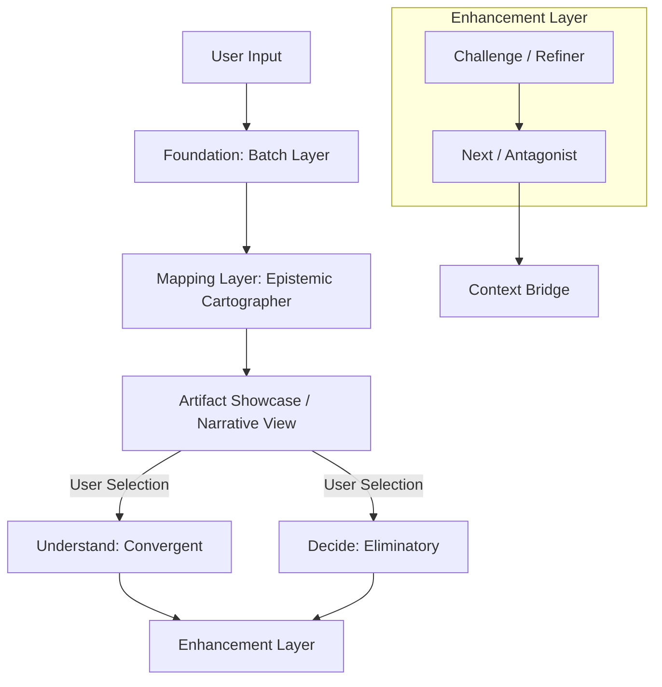

# Singularity: Technical Architecture Specification (v3)

## The Cognitive Flow

The Singularity architecture has evolved from a linear pipeline to a flexible **Cognitive Flow**. This model prioritizes user agency, allowing dynamic navigation between "seeing the landscape" (Mapping), "finding the frame" (Understanding), and "forcing a choice" (Deciding), with optional enhancement layers for rigorous stress-testing.

---

## Layer 1: Foundation (Batch)

### Purpose
Maximize information diversity through parallel querying of multiple models. The foundation executes for every query.

**Inputs**: User Prompt
**Outputs**: 6 Raw Model Outputs (Reasoning + Content)

---

## Layer 2: Mapping (Epistemic Cartographer)

### Purpose
Transform raw model outputs into a stable, structured artifact. The Mapper subsumes the role of the previous "Explorer" by directly producing a navigable inventory of options and a narrative landscape.

### Logic
The Mapper performs "Epistemic Cartography"—mapping the space of possible answers without choosing one. It identifies consensus, isolates outliers, and constructs the topology of the problem space.

**Inputs**: 
- User Prompt
- Batch Outputs

**Outputs**:
- **Narrative**: A cohesive story describing the landscape of opinion.
- **Options Inventory**: Structured list of distinct approaches/claims available (formerly "Explore" content).
- **Artifact**: Validated structured object (Consensus + Outliers).
- **Graph Topology**: Metadata describing the shape of agreement (High Confidence, Dimensional, Contested).

### User Experience: The Artifact Showcase
Instead of a text-based "Explore Mode", the user is immediately presented with the **Artifact Showcase**.
- **Visual**: Cards, Graphs, or Lists representing the Options Inventory.
- **Action**: User reviews the landscape and chooses the next cognitive move (Understand vs Decide).

---

## Layer 3: Primary Synthesis

The user chooses one of two mutually exclusive synthesis modes based on their goal.

### Mode A: Understand (Convergent)

**"How it all fits."**

**Purpose**: Frame-finding. Searches for the meta-perspective where all strongest insights coexist.
**Ideal For**: "Explain", "Why", "Help me understand", "Conflict resolution".

**Inputs**:
- User Prompt
- Full Mapper Artifact

**Outputs**:
- `short_answer`: The frame crystallized.
- `long_answer`: The frame inhabited.
- `the_one`: The single pivot insight that holds the frame.
- `the_echo`: The strongest surviving contrarian view.
- `gaps_addressed`: Missing context filled by synthesis.

### Mode B: Decide (Eliminatory / Gauntlet)

**"What survives scrutiny."**

**Purpose**: Closure. Subjecting every claim to hostile scrutiny against an "Optimal End".
**Ideal For**: "What should I do", "Pick one", "Action needed".

**Inputs**:
- User Prompt
- Full Mapper Artifact

**Outputs**:
- `the_answer.statement`: The survivor decision.
- `the_answer.reasoning`: Why it won.
- `survivors`: Claims that passed stress-testing.
- `eliminated`: Claims killed (and why).
- `the_void`: Unaddressed gaps.
- `confidence`: Reliability score of the decision.

---

## Layer 4: Enhancement

Optional high-rigor layers that run *after* synthesis to harden the result.

### Step 1: Challenge (The Refiner)

**Purpose**: Constructive adversarial review.
**Logic**: "Build an equally strong answer from what the synthesis missed." It scans the Batch outputs and Mapper Artifact for high-quality data that was discarded in the primary synthesis and constructs a counter-argument or refinement.

**Inputs**: 
- User Prompt 
- Batch Outputs 
- Mapper Narrative 
- Primary Synthesis Output (Understand or Decide)

**Outputs**:
- `final_word`: A refined synthesis incorporating the missed value.
- `the_one` / `the_echo`: Updated key insights.
- `the_step`: A specific concrete next action.

### Step 2: Next (The Antagonist)

**Purpose**: Failsafe & Context Elicitation.
**Logic**: The "Devil's Advocate". It assumes the current best answer is wrong or incomplete and demands the specific context that would break it.

**Inputs**:
- All previous inputs
- Refiner Output (if exists)

**Outputs**:
- `structured_prompt`: A question back to the user to clarify ambiguity (if needed).
- `dimensions`: The critical axes on which the answer depends.
- `grounding`: Reality checks.
- `audit`: Final security/logic pass.

---

## Layer 5: Context Bridge

**Purpose**: Continuity across turns.

**Mechanism**:
The final stable artifacts (Short Answer/Statement + Mapper Narrative/Options) are injected into the Prompt history for the *next* turn. This ensures the AI remembers not just the "chat text" but the *structural conclusion* of the previous thought process.