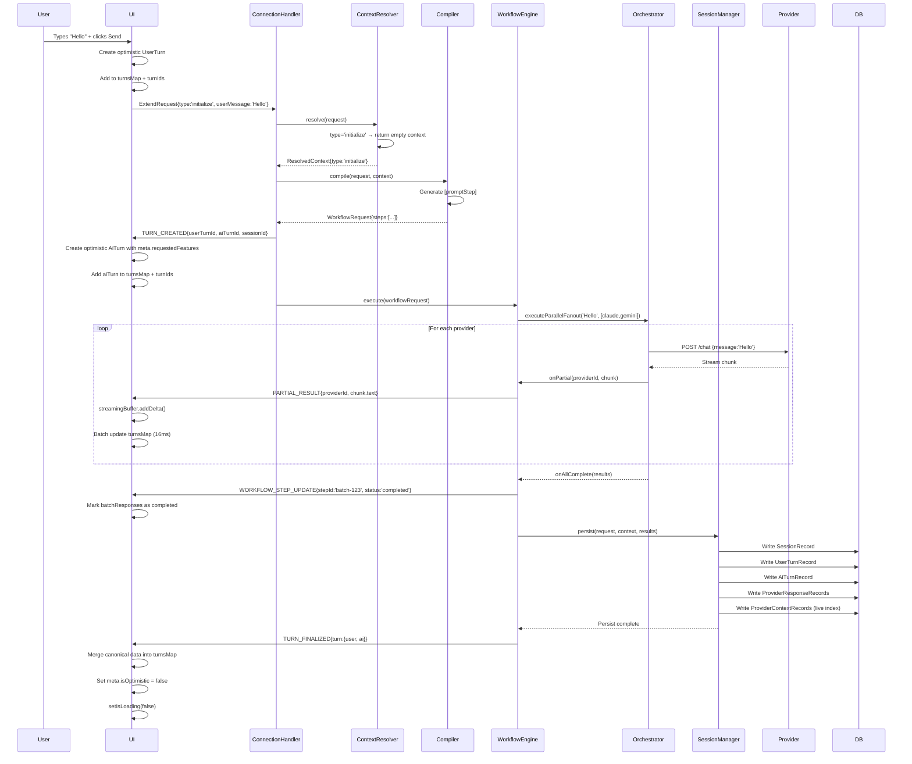
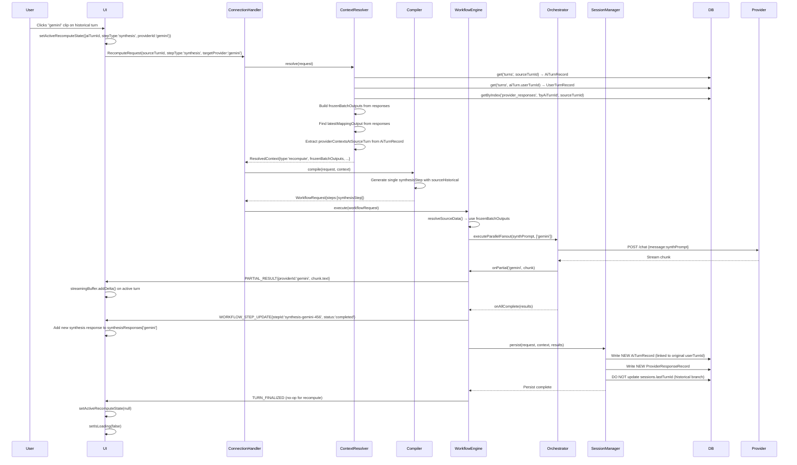
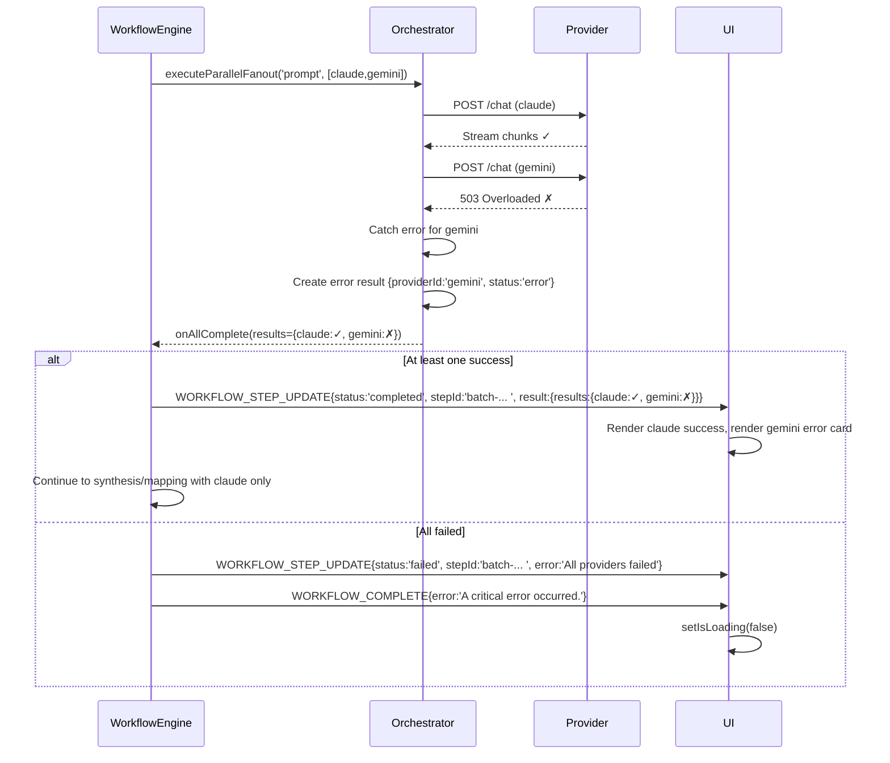

# Critical Flows

## 1. User Sends First Message (Initialize)

**Actors:** User, UI, ConnectionHandler, ContextResolver, Compiler, WorkflowEngine, Orchestrator, SessionManager

## 2. User Re-runs Synthesis with Different Model (Recompute)

**Actors:** User, UI, ConnectionHandler, ContextResolver, Compiler, WorkflowEngine, Orchestrator, SessionManager

## 3. Provider Fails (Error Handling)

**Actors:** WorkflowEngine, Orchestrator, Provider, UI

