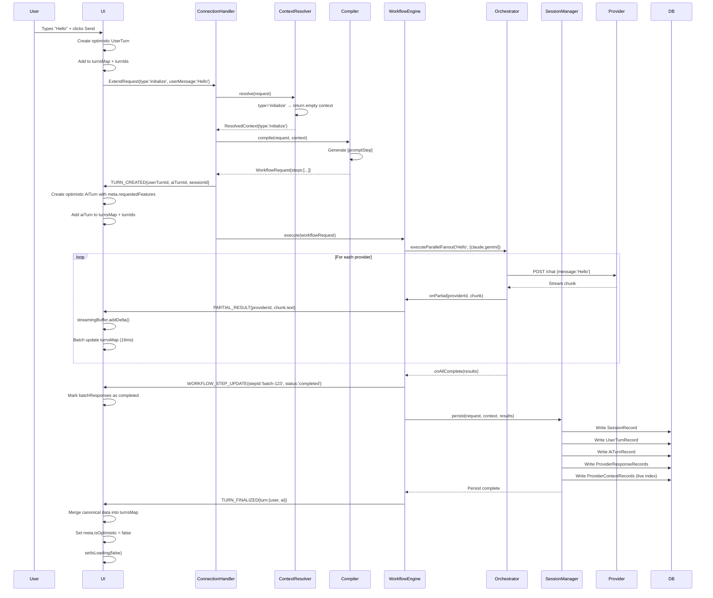
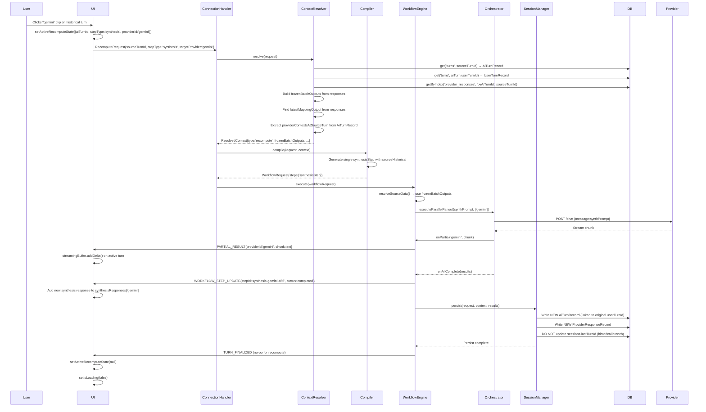
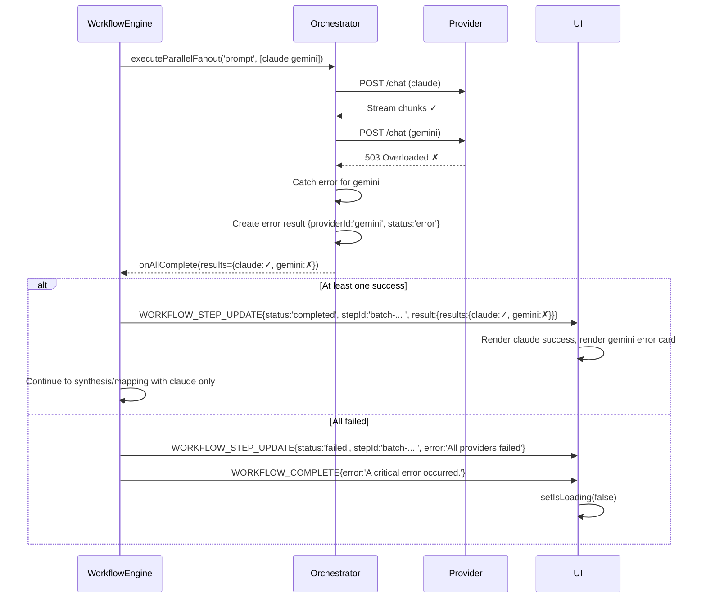

---

  

# Singularity System Architecture Overview

  

**Version:** 3.0  

**Last Updated:** 2025-12-25  

**Purpose:** Complete architectural blueprint for contributors working on any layer of the system

  

---

  

## Table of Contents

  

1. [System Philosophy](https://claude.ai/chat/90e57a76-883e-4eaf-9601-5170a9f32a9b#1-system-philosophy)

2. [Data Contracts: The Language of the System](https://claude.ai/chat/90e57a76-883e-4eaf-9601-5170a9f32a9b#2-data-contracts)

3. [Backend: The Resolve → Compile → Execute Pipeline](https://claude.ai/chat/90e57a76-883e-4eaf-9601-5170a9f32a9b#3-backend-pipeline)

4. [UI State Management: The Frontend Brain](https://claude.ai/chat/90e57a76-883e-4eaf-9601-5170a9f32a9b#4-ui-state-management)

5. [Rendering Layer: State to Pixels](https://claude.ai/chat/90e57a76-883e-4eaf-9601-5170a9f32a9b#5-rendering-layer)

6. [Critical Flows](https://claude.ai/chat/90e57a76-883e-4eaf-9601-5170a9f32a9b#6-critical-flows)

7. [Debugging Guide](https://claude.ai/chat/90e57a76-883e-4eaf-9601-5170a9f32a9b#7-debugging-guide)

  

---

  

## 1. System Philosophy

  

### Core Principles

  

**Immutable History, Live Context**  

The system maintains a complete, immutable record of every conversation turn while keeping a separate, hot-path index (`provider_contexts`) for fast continuation lookups. This dual-layer design enables both historical integrity and real-time performance.

  

**Three Primitives, One Truth**  

All workflows reduce to three primitives:

  

- `initialize`: Start a new conversation

- `extend`: Continue with live context

- `recompute`: Re-run historical steps without advancing the timeline

  

**Optimistic UI, Canonical Backend**  

The UI renders immediately using optimistic IDs and placeholder data. The backend sends `TURN_CREATED` and `TURN_FINALIZED` messages with canonical IDs. The UI replaces optimistic data with canonical data upon finalization, never remapping IDs.

  

**Streaming-First**  

Every AI response streams character-by-character via `PARTIAL_RESULT` messages. The UI uses a `StreamingBuffer` to batch DOM updates, achieving 60fps rendering even during multi-provider fan-out.

**Cognitive Halt, User-Selected Lenses**  
When `USE_COGNITIVE_PIPELINE` is enabled, the backend intentionally halts after building a stable “Decision Map” (`MapperArtifact`) and a computed triage (`ExploreAnalysis`). The user then chooses a reasoning lens:

- `Explore` (computed, no extra model call): shows the landscape using a container selected by `computeExplore()`
- `Understand` (LLM call): produces a high-fidelity synthesis using the **One / Echo** framework
- `Decide` (LLM call): runs the **Gauntlet** to stress-test and eliminate weak claims

This shift turns the system from a “single synthesis generator” into an **interactive cognitive pipeline** that preserves the raw multi-model landscape while letting the user decide how to collapse it.

---

  

## 2. Data Contracts: The Language of the System

  

### 2.1 Request Primitives (`shared/contract.ts`)

  

These are the three workflow primitives the backend compiles and executes:

  

```typescript
export type CognitiveMode = "auto" | "explore" | "understand" | "decide";

interface InitializeRequest {
  type: "initialize";
  sessionId?: string | null;
  userMessage: string;
  providers: ProviderKey[];
  includeMapping: boolean;
  includeSynthesis: boolean;
  includeRefiner?: boolean;
  includeAntagonist?: boolean;
  synthesizer?: ProviderKey;
  mapper?: ProviderKey;
  refiner?: ProviderKey;
  antagonist?: ProviderKey;
  useThinking?: boolean;
  providerMeta?: Partial<Record<ProviderKey, any>>;
  clientUserTurnId?: string;
  mode?: CognitiveMode;
}

interface ExtendRequest {
  type: "extend";
  sessionId: string;
  userMessage: string;
  providers: ProviderKey[];
  forcedContextReset?: ProviderKey[];
  includeMapping: boolean;
  includeSynthesis: boolean;
  synthesizer?: ProviderKey;
  mapper?: ProviderKey;
  refiner?: ProviderKey;
  antagonist?: ProviderKey;
  includeRefiner?: boolean;
  includeAntagonist?: boolean;
  useThinking?: boolean;
  providerMeta?: Partial<Record<ProviderKey, any>>;
  clientUserTurnId?: string;
  mode?: CognitiveMode;
}

interface RecomputeRequest {
  type: "recompute";
  sessionId: string;
  sourceTurnId: string;
  stepType: "synthesis" | "mapping" | "batch" | "refiner" | "antagonist";
  targetProvider: ProviderKey;
  userMessage?: string;
  useThinking?: boolean;
}
```

  

### 2.2 Real-Time Messages (Backend → UI)

  

The backend sends these messages over a persistent `chrome.runtime.Port`:

  

```typescript

// Workflow lifecycle

interface TurnCreatedMessage {
  type: "TURN_CREATED";
  sessionId: string;
  userTurnId: string;
  aiTurnId: string;
  providers?: ProviderKey[];
  synthesisProvider?: ProviderKey | null;
  mappingProvider?: ProviderKey | null;
  refinerProvider?: ProviderKey | null;
  antagonistProvider?: ProviderKey | null;
}

  

// Streaming updates (sent hundreds of times per turn)

interface PartialResultMessage {
  type: "PARTIAL_RESULT";
  sessionId: string;
  stepId: string;
  providerId: ProviderKey;
  chunk: { text?: string; meta?: any };
}

  

// Step completion

interface WorkflowStepUpdateMessage {
  type: "WORKFLOW_STEP_UPDATE";
  sessionId: string;
  stepId: string;
  status: "completed" | "failed";
  result?: {
    results?: Record<string, ProviderResponse>; // Batch steps
    providerId?: string; // Single-provider steps
    text?: string;
    status?: string;
    meta?: any; // Holds structured outputs (e.g., understandOutput, gauntletOutput)
  };
  error?: string;
}

interface WorkflowProgressMessage {
  type: "WORKFLOW_PROGRESS";
  sessionId: string;
  aiTurnId: string;
  phase: "batch" | "synthesis" | "mapping";
  providerStatuses: ProviderStatus[];
  completedCount: number;
  totalCount: number;
  estimatedTimeRemaining?: number;
}

interface ProviderStatus {
  providerId: string;
  status: "queued" | "active" | "streaming" | "completed" | "failed" | "skipped";
  progress?: number;
  error?: ProviderError;
  skippedReason?: string;
}

interface ProviderError {
  type:
    | "rate_limit"
    | "auth_expired"
    | "timeout"
    | "circuit_open"
    | "content_filter"
    | "input_too_long"
    | "network"
    | "unknown";
  message: string;
  retryable: boolean;
  retryAfterMs?: number;
  requiresReauth?: boolean;
}

interface WorkflowPartialCompleteMessage {
  type: "WORKFLOW_PARTIAL_COMPLETE";
  sessionId: string;
  aiTurnId: string;
  successfulProviders: string[];
  failedProviders: Array<{ providerId: string; error: ProviderError }>;
  synthesisCompleted: boolean;
  mappingCompleted: boolean;
}

  

// Final canonical data

interface TurnFinalizedMessage {

  type: "TURN_FINALIZED";

  sessionId: string;

  userTurnId: string;

  aiTurnId: string;

  turn: {

    user: UserTurn;

    ai: AiTurn;

  };

}

```

  

### 2.3 Core Data Shapes (`ui/types.ts`)

  

**Turn Types (UI State)**

  

```typescript

interface UserTurn {

  type: "user";

  id: string;

  text: string;

  createdAt: number;

  sessionId: string | null;

}

  

interface AiTurn {
  type: "ai";
  id: string;
  userTurnId: string;
  sessionId: string;
  threadId: string;
  createdAt: number;

  batchResponses: Record<string, ProviderResponse[]>;
  synthesisResponses: Record<string, ProviderResponse[]>;
  mappingResponses: Record<string, ProviderResponse[]>;
  refinerResponses?: Record<string, ProviderResponse[]>;
  antagonistResponses?: Record<string, ProviderResponse[]>;
  exploreResponses?: Record<string, ProviderResponse[]>;
  understandResponses?: Record<string, ProviderResponse[]>;
  gauntletResponses?: Record<string, ProviderResponse[]>;

  // Cognitive Pipeline Artifacts (Computed)
  mapperArtifact?: MapperArtifact;
  exploreAnalysis?: ExploreAnalysis;
  understandOutput?: UnderstandOutput;
  gauntletOutput?: GauntletOutput;

  // Versioning: bump to force reactive UI re-renders per specialized output
  synthesisVersion?: number;
  mappingVersion?: number;
  refinerVersion?: number;
  antagonistVersion?: number;
  understandVersion?: number;
  gauntletVersion?: number;

  meta?: {
    branchPointTurnId?: string;
    replacesId?: string;
    isHistoricalRerun?: boolean;
    synthForUserTurnId?: string;
    isOptimistic?: boolean;
    requestedFeatures?: { synthesis: boolean; mapping: boolean };
    [key: string]: any;
  };
}

  

interface ProviderResponse {
  providerId: string;
  text: string;
  status: "pending" | "streaming" | "completed" | "error";
  createdAt: number;
  updatedAt?: number;
  attemptNumber?: number;
  artifacts?: Array<{ title: string; identifier: string; content: string; type: string }>;
  meta?: {
    conversationId?: string;
    parentMessageId?: string;
    tokenCount?: number;
    thinkingUsed?: boolean;
    _rawError?: string;
    graphTopology?: GraphTopology;
    allAvailableOptions?: string;
    citationSourceOrder?: Record<string | number, string>;
    synthesizer?: string;
    mapper?: string;
    [key: string]: any;
  };
}

```

  

**Persistence Records (Database Schema)**

  

```typescript

// sessions table

interface SessionRecord {

  id: string;

  title: string;

  createdAt: number;

  updatedAt: number;

  lastTurnId: string | null; // Points to latest AI turn on main timeline

  turnCount: number;

}

  

// turns table (polymorphic)

type TurnRecord = UserTurnRecord | AiTurnRecord;

  

interface AiTurnRecord {

  id: string;

  type: "ai";

  role: "assistant";

  sessionId: string;

  userTurnId: string;

  threadId: string;

  sequence: number;

  createdAt: number;

  updatedAt: number;

  

  // Counts only; actual responses live in provider_responses

  batchResponseCount: number;

  synthesisResponseCount: number;

  mappingResponseCount: number;

  

  // Snapshot of contexts at this point in time (for recompute)

  providerContexts?: Record<string, any>;

}

  

// provider_responses table (append-only log)

interface ProviderResponseRecord {

  id: string;

  sessionId: string;

  aiTurnId: string;

  providerId: string;

  responseType: "batch" | "synthesis" | "mapping";

  responseIndex: number;

  text: string;

  status: string;

  createdAt: number;

  updatedAt: number;

  meta?: any;

}

  

// provider_contexts store (live continuation metadata)

// Primary Key: [sessionId, providerId]

// contextData holds provider-specific continuation info used by the 'extend' primitive

interface ProviderContextRecord {

  sessionId: string;

  providerId: string;

  contextData: any; // e.g., { conversationId, parentMessageId, threadId }

  updatedAt: number;

}

```

  

---

  

## 3. Backend Pipeline: Resolve → Compile → Execute
  
### 3.X The Cognitive Pipeline (V3): Mapper → Halt → Specialized Lens
  
When `USE_COGNITIVE_PIPELINE` is enabled, the core execution model becomes:
  
```text
Batch Fan-Out
  ↓
Mapper V2 (produces MapperArtifact)
  ↓
Explore Computer (computeExplore → ExploreAnalysis)
  ↓
COGNITIVE HALT (UI chooses lens)
  ↓
Understand (One/Echo)  OR  Decide (Gauntlet)
```
  
**Key consequence:** the system persists a stable “Decision Map” first, then performs user-selected collapse. This preserves optionality and prevents premature synthesis.
  
**Key files:**
- `shared/contract.ts` — `MapperArtifact`, `ExploreAnalysis`, `UnderstandOutput`, `GauntletOutput`
- `shared/parsing-utils.ts` — `parseMapperArtifact`, `parseUnderstandOutput`, `parseGauntletOutput`
- `src/core/PromptService.ts` — `buildMapperV2Prompt`, `buildUnderstandPrompt`, `buildGauntletPrompt`
- `src/core/cognitive/explore-computer.ts` — `computeExplore()` (pure compute triage)
- `src/core/workflow-engine.js` — cognitive halt and mode continuation
- `src/core/connection-handler.js` — handles `CONTINUE_COGNITIVE_WORKFLOW`
- `ui/hooks/chat/usePortMessageHandler.ts` — handles `MAPPER_ARTIFACT_READY` and specialized step updates
- `ui/components/cognitive/CognitiveOutputRenderer.tsx` — the UI hub for artifact/showcase vs specialized modes
  
  

### 3.1 Entry Point: Connection Handler

  

**File:** `src/core/connection-handler.js`

  

```javascript

async _handleExecuteWorkflow(message) {

  const request = message.payload;

  

  // PHASE 1: Validate primitive type

  if (!['initialize', 'extend', 'recompute'].includes(request.type)) {

    throw new Error('Invalid request type');

  }

  

  // PHASE 2: Resolve context

  const resolvedContext = await this.services.contextResolver.resolve(request);

  

  // PHASE 3: Compile workflow

  const workflowRequest = this.services.compiler.compile(request, resolvedContext);

  

  // PHASE 4: Emit TURN_CREATED (for non-recompute)

  if (request.type !== 'recompute') {

    this.port.postMessage({

      type: 'TURN_CREATED',

      sessionId: workflowRequest.context.sessionId,

      userTurnId: workflowRequest.context.canonicalUserTurnId,

      aiTurnId: workflowRequest.context.canonicalAiTurnId

    });

  }

  

  // PHASE 5: Execute

  await this.workflowEngine.execute(workflowRequest, resolvedContext);

}

```

  

### 3.2 Context Resolver: Data Fetcher

  

**File:** `src/core/context-resolver.js`

  

**Purpose:** Fetch minimum required data for each primitive. This is the performance bottleneck—must be fast.

  

```javascript

async resolve(request) {

  switch (request.type) {

    case 'initialize':

      return { type: 'initialize', providers: request.providers };

  

    case 'extend':

      // Fast path: indexed lookup on provider_contexts for the given session

      const contexts = await this.sessionManager.adapter.getContextsBySessionId(request.sessionId);

  

      return {

        type: 'extend',

        sessionId: request.sessionId,

        providerContexts: contexts.reduce((acc, ctx) => {

          acc[ctx.providerId] = {

            meta: ctx, // compound PK [sessionId, providerId] in store

            continueThread: true

          };

          return acc;

        }, {})

      };

  

    case 'recompute':

      // Heavy path: fetch historical turn + all responses

      const aiTurn = await this.sessionManager.adapter.get('turns', request.sourceTurnId);

      const userTurn = await this.sessionManager.adapter.get('turns', aiTurn.userTurnId);

      const responses = await this.sessionManager.adapter.getByIndex(

        'provider_responses',

        'byAiTurnId',

        request.sourceTurnId

      );

  

      // Build frozen outputs

      const frozenBatchOutputs = {};

      let latestMappingOutput = null;

  

      responses.forEach(r => {

        if (r.responseType === 'batch') {

          frozenBatchOutputs[r.providerId] = {

            providerId: r.providerId,

            text: r.text,

            status: 'completed',

            meta: r.meta

          };

        } else if (r.responseType === 'mapping') {

          latestMappingOutput = {

            providerId: r.providerId,

            text: r.text,

            meta: r.meta

          };

        }

      });

  

      return {

        type: 'recompute',

        sessionId: request.sessionId,

        sourceTurnId: request.sourceTurnId,

        frozenBatchOutputs,

        latestMappingOutput,

        providerContextsAtSourceTurn: aiTurn.providerContexts || {},

        stepType: request.stepType,

        targetProvider: request.targetProvider,

        sourceUserMessage: userTurn.text

      };

  }

}

```

  

### 3.3 Workflow Compiler: Instruction Generator

  

**File:** `src/core/workflow-compiler.js`

  

**Purpose:** Pure function that converts request + context into imperative steps.

  

```javascript

compile(request, resolvedContext) {

  const steps = [];

  

  if (request.type === 'recompute') {

    // Single step: synthesis or mapping

    if (request.stepType === 'synthesis') {

      steps.push({

        stepId: `synthesis-${request.targetProvider}-${Date.now()}`,

        type: 'synthesis',

        payload: {

          synthesisProvider: request.targetProvider,

          strategy: 'continuation',

          sourceHistorical: {

            turnId: request.sourceTurnId,

            responseType: 'batch'

          },

          originalPrompt: resolvedContext.sourceUserMessage,

          useThinking: request.useThinking

        }

      });

    }

    // ... similar for mapping

  } else {

    // Normal flow: batch → mapping → synthesis

  

    // Step 1: Prompt step

    steps.push({

      stepId: `batch-${Date.now()}`,

      type: 'prompt',

      payload: {

        prompt: request.userMessage,

        providers: request.providers,

        providerContexts: resolvedContext.providerContexts, // From extend

        useThinking: request.useThinking

      }

    });

  

    // Step 2: Mapping (if requested)

    if (request.includeMapping && request.mapper) {

      steps.push({

        stepId: `mapping-${request.mapper}-${Date.now()}`,

        type: 'mapping',

        payload: {

          mappingProvider: request.mapper,

          sourceStepIds: [steps[0].stepId],

          originalPrompt: request.userMessage,

          useThinking: request.useThinking

        }

      });

    }

  

    // Step 3: Synthesis (if requested)

    if (request.includeSynthesis && request.synthesizer) {

      const mappingStepIds = steps

        .filter(s => s.type === 'mapping')

        .map(s => s.stepId);

  

      steps.push({

        stepId: `synthesis-${request.synthesizer}-${Date.now()}`,

        type: 'synthesis',

        payload: {

          synthesisProvider: request.synthesizer,

          sourceStepIds: [steps[0].stepId],

          mappingStepIds,

          originalPrompt: request.userMessage,

          useThinking: request.useThinking

        }

      });

    }

  }

  

  return {

    workflowId: `wf-${Date.now()}`,

    context: {

      sessionId: request.sessionId,

      threadId: 'default-thread',

      canonicalUserTurnId: request.clientUserTurnId || `user-${Date.now()}`,

      canonicalAiTurnId: `ai-${Date.now()}`

    },

    steps

  };

}

```

  

### 3.4 Workflow Engine: Step Executor

  

**File:** `src/core/workflow-engine.js`

  

**Purpose:** Execute steps in sequence, stream results to UI, persist on completion.

  

```javascript

async execute(workflowRequest, resolvedContext) {

  const { context, steps } = workflowRequest;

  const stepResults = new Map();

  

  // Execute batch steps first

  for (const step of steps.filter(s => s.type === 'prompt')) {

    // NEW: Signal step start to UI (planned)

    // this.port.postMessage({ type: 'WORKFLOW_STEP_STARTED', stepType: 'batch', stepId: step.stepId, sessionId: context.sessionId });

    const result = await this.executePromptStep(step, context);

    stepResults.set(step.stepId, { status: 'completed', result });

  

    this.port.postMessage({

      type: 'WORKFLOW_STEP_UPDATE',

      sessionId: context.sessionId,

      stepId: step.stepId,

      status: 'completed',

      result

    });

  }

  

  // Execute mapping steps

  for (const step of steps.filter(s => s.type === 'mapping')) {

    const result = await this.executeMappingStep(step, context, stepResults);

    stepResults.set(step.stepId, { status: 'completed', result });

  

    this.port.postMessage({

      type: 'WORKFLOW_STEP_UPDATE',

      sessionId: context.sessionId,

      stepId: step.stepId,

      status: 'completed',

      result

    });

  }

  

  // Execute synthesis steps

  for (const step of steps.filter(s => s.type === 'synthesis')) {

    const result = await this.executeSynthesisStep(step, context, stepResults);

    stepResults.set(step.stepId, { status: 'completed', result });

  

    this.port.postMessage({

      type: 'WORKFLOW_STEP_UPDATE',

      sessionId: context.sessionId,

      stepId: step.stepId,

      status: 'completed',

      result

    });

  }

  

  // Persist to database

  await this.sessionManager.persist({

    type: resolvedContext.type,

    sessionId: context.sessionId,

    userMessage: context.userMessage,

    canonicalUserTurnId: context.canonicalUserTurnId,

    canonicalAiTurnId: context.canonicalAiTurnId

  }, resolvedContext, stepResults);

  

  // Emit finalized turn

  this.port.postMessage({

    type: 'TURN_FINALIZED',

    sessionId: context.sessionId,

    userTurnId: context.canonicalUserTurnId,

    aiTurnId: context.canonicalAiTurnId,

    turn: {

      user: { id: context.canonicalUserTurnId, text: context.userMessage },

      ai: { id: context.canonicalAiTurnId, batchResponses: {}, ... }

    }

  });

}

  

async executePromptStep(step, context) {

  const { prompt, providers, providerContexts } = step.payload;

  

  return new Promise((resolve) => {

    this.orchestrator.executeParallelFanout(prompt, providers, {

      sessionId: context.sessionId,

      providerContexts,

      onPartial: (providerId, chunk) => {

        // Stream to UI immediately

        this._dispatchPartialDelta(

          context.sessionId,

          step.stepId,

          providerId,

          chunk.text

        );

      },

      onAllComplete: (results) => {

        resolve({ results: Object.fromEntries(results) });

      }

    });

  });

}

```
  
#### Cognitive Halt (MapperArtifact Ready)
  
When cognitive mode is enabled, the workflow halts immediately after mapping—right after emitting a stable artifact and its computed analysis:
  
```javascript
if (context.useCognitivePipeline) {
  const mappingResult = [...stepResults.entries()].find(([_, v]) =>
    v.status === 'completed' && v.result?.mapperArtifact
  )?.[1]?.result;

  if (mappingResult?.mapperArtifact) {
    const mapperArtifact = mappingResult.mapperArtifact;
    const exploreAnalysis = computeExplore(context.userMessage || '', mapperArtifact);

    this.port.postMessage({
      type: 'MAPPER_ARTIFACT_READY',
      sessionId: context.sessionId,
      aiTurnId: context.canonicalAiTurnId,
      artifact: mapperArtifact,
      analysis: exploreAnalysis,
    });

    this._emitTurnFinalized(context, steps, stepResults, resolvedContext);
    this.port.postMessage({ type: "WORKFLOW_COMPLETE", sessionId: context.sessionId });
    return;
  }
}
```
  
This is the “choice point” in the system: the UI has everything it needs to show the landscape, but nothing has been collapsed into a single answer yet.

  

### 3.5 System Prompts: Synthesizer and Mapper

  

**File:** `src/core/PromptService.ts`

  

**Purpose:** These prompts define how the synthesis and mapping steps transform batch outputs.

  
#### Mapper V2 Prompt (buildMapperV2Prompt)
  
The V3 Mapper converts raw batch outputs into a stable artifact (`MapperArtifact`) that all cognitive modes consume:
  
```typescript
// src/core/PromptService.ts (excerpt)
buildMapperV2Prompt(userPrompt, batchOutputs) {
  const modelOutputsBlock = batchOutputs
    .map((res, idx) => `=== MODEL ${idx + 1} (${res.providerId}) ===\n${res.text}`)
    .join("\n\n");

  return `You are the Mapper—the cognitive layer that organizes raw intelligence into structured topology.
You do not synthesize. You do not decide. You catalog, verify, and map.

## Your Task
Perform a four-pass analysis on the model outputs to produce a high-fidelity decision map.

### Pass 1: Consensus Extraction
Identify claims supported by at least 2 models (merge by meaning, not words).

### Pass 2: Outlier Extraction
Identify unique high-value insights and preserve "Frame Challengers".

### Pass 3: Semantic Logic Collapse
Merge true equivalents, keep distinct mechanisms separate.

### Pass 4: Tension Detection
Identify conflicts or trade-offs between claims.

## Output Format
Return valid JSON ONLY matching the MapperArtifact schema.

## Model Outputs
${modelOutputsBlock}`;
}
```
  
This output becomes the stable “Decision Map” that powers the rest of the pipeline.
  
---
  
#### Understand Prompt (buildUnderstandPrompt)
  
Understand is the controlled collapse: it turns the map into a coherent answer using **The One / The Echo**:
  
```typescript
// src/core/PromptService.ts (excerpt)
buildUnderstandPrompt(originalPrompt, mapperArtifact, analysis) {
  return `You are the Understand mode—the cognitive layer that synthesizes a multi-perspective landscape into a coherent, high-fidelity answer.

User Query: "${originalPrompt}"
Query Type: ${analysis.queryType}
Container Selected: ${analysis.containerType}

## Your Mission
1. The One: identify the single most significant insight.
2. The Echo: identify the strongest contrarian or frame-challenger.
3. Synthesis: produce short_answer + long_answer.

## Output Format
Return valid JSON ONLY (UnderstandOutput).`;
}
```
  
---
  
#### Decide Prompt (buildGauntletPrompt)
  
Decide is adversarial collapse: it stress-tests claims and eliminates weak ones before issuing a verdict:
  
```typescript
// src/core/PromptService.ts (excerpt)
buildGauntletPrompt(originalPrompt, mapperArtifact) {
  return `You are the Gauntlet—the final arbiter of truth.

## Your Mission: The Cull
1. Stress-test consensus: eliminate weak/vague/unsound claims.
2. Interrogate outliers: genius vs noise; correct outliers can kill consensus.
3. The Survivor: deliver the single decisive answer.

## Output Format
Return valid JSON ONLY (GauntletOutput).`;
}
```
  
---
  
#### Synthesizer Prompt (buildSynthesisPrompt)

  

The synthesizer creates a unified response that "could only exist" from seeing all models:

  

```javascript

// Key excerpt from buildSynthesisPrompt (src/core/PromptService.ts)

const finalPrompt = `Your task is to create a response to the user's prompt,

leveraging all available outputs, resources and insights, that could *only exist*

because all of these models responded first to:

  

<original_user_query>

${originalPrompt}

</original_user_query>

  

Process:

Review your earlier response from the conversation history above.

Review all batch outputs from other models below.

Each reflects a different way of understanding the question—different assumptions,

priorities, and mental models. These are not drafts to judge, but perspectives to understand.

  

Output Requirements:

Don't select the strongest argument. Don't average positions. Instead, imagine a frame

where all the strongest insights make sense—not as compromises, but as natural expressions

of different facets of a larger truth. Build that frame. Speak from it.

  

<model_outputs>

${otherResults}

</model_outputs>

  

Begin.

  

When outputting your synthesis, be sure to start with a "The Short Answer" title which

gives a brief overview of your whole response in no more than a paragraph or two, before

writing a "The Long Answer" header which contains your actual response.`;

```

  

**Output Contract:**

- **The Short Answer:** 1-2 paragraph overview

- **The Long Answer:** Full synthesis

  

---

  

#### Mapper V1 Prompt (buildMappingPrompt, legacy)

  

The mapper is a "provenance tracker and option cataloger" that reveals consensus patterns and divergence:

  

```javascript

// Key excerpt from buildMappingPrompt (src/core/PromptService.ts)

return `You are not a synthesizer. You are a provenance tracker and option cataloger,

a mirror that reveals what others cannot see.

  

CRUCIAL: Before writing, extract every distinct approach/stance/capability from

synthesis + raw outputs. Assign each a permanent canonical label (max 6 words, precise,

unique). These labels link narrative ↔ options ↔ graph—reuse them verbatim throughout.

  

Task: Present ALL insights from the model outputs below in their most useful form for

decision-making on the user's prompt that maps the terrain and catalogs every approach.

  

<user_prompt>: ${String(userPrompt || "")} </user_prompt>

  

A synthesis has been created:

<synthesis>${synthesisText}</synthesis>

  

<model_outputs>:

${modelOutputsBlock}

</model_outputs>

  

**Task 1: Narrative**

Write a fluid, insightful narrative that explains:

- Where models agreed (and why that might be a blind spot)

- Where they diverged (and what that reveals)

- Trade-offs each model made

- Questions the synthesis didn't answer

  

Embed citations [1], [2, 3] throughout. When discussing an approach, use its canonical

label in **bold** as a recognizable anchor.

  

**Task 2: All Options Inventory**

After your narrative, add exactly:

"===ALL_AVAILABLE_OPTIONS==="

  

List EVERY distinct approach from synthesis + raw outputs:

- **[Canonical Label]:** 1-2 sentence summary [1, 3, 5]

- Group by theme

- Deduplicate rigorously

- Order by prevalence

  

**Task 3: Topology (for visualization)**

After the options list, add exactly:

"===GRAPH_TOPOLOGY==="

  

Output JSON:

{

  "nodes": [

    {

      "id": "opt_1",

      "label": "<exact canonical label from Task 2>",

      "theme": "<theme name>",

      "supporters": [<model numbers>],

      "support_count": <number>

    }

  ],

  "edges": [

    {

      "source": "<node id>",

      "target": "<node id>",

      "type": "conflicts" | "complements" | "prerequisite",

      "reason": "<one phrase explaining relationship>"

    }

  ]

}

  

Edge types:

- **conflicts**: Mutually exclusive or opposing philosophies

- **complements**: Work well together or one enables the other

- **prerequisite**: Must be done before the other

  

Labels must match exactly across narrative, options, and graph nodes.

  

Begin.`;

```

  

**Output Contract:**

1. **Narrative:** Prose with embedded citations `[1,2,3]` and **bold canonical labels**

2. **Delimiter:** `===ALL_AVAILABLE_OPTIONS===`

3. **Options List:** Grouped by theme, with citations

4. **Delimiter:** `===GRAPH_TOPOLOGY===`

5. **JSON Graph:** Nodes (with supporters) + Edges (with relationship types)

  

---

  

### 3.6 Pre-Flight Refinement: PromptRefinerService

  

**File:** `src/services/PromptRefinerService.ts`

  

**Purpose:** Two-stage pipeline (Composer → Analyst) that refines user prompts before batch fan-out.

  

#### Composer Role

  

The Composer is the "user's voice, clarified"—a hinge between user and the batch pipeline.

  

```typescript

// Key excerpt from COMPOSER_SYSTEM_PROMPT (lines 32-135)

const COMPOSER_SYSTEM_PROMPT = `You are the user's voice, clarified, and the hinge

between the user and a bank of parallel AI models.

  

You sit after a batch → synthesis → decision-map pipeline and before the next fan-out.

Your job is to help the user decide and shape what gets sent next, without dumbing it

down to "just another chat turn."

  

You operate in two overlapping modes:

- Thinking partner: the user can talk to you directly about what they're trying to do next.

- Prompt composer/refiner: the user can hand you a draft of what they want to send, and

  you sharpen it into what they truly meant to ask.

  

You ALWAYS have access to:

\${contextSection}  // Previous turn: synthesis, decision map, batch responses

\${analystCritiqueSection}  // Optional: if Analyst ran first

  

The user's latest input is wrapped as:

<DRAFT_PROMPT>

\${draftPrompt}

</DRAFT_PROMPT>

  

MODE DETECTION (INTERNAL, DO NOT OUTPUT AS A LIST)

- If the content is clearly a message *to you* (e.g. "what do you think we should do

  next?"), treat it as meta-intent.

- If the content reads like something they want the other models to answer (an instruction,

  a question, a spec), treat it as a draft prompt.

  

OUTPUT LOGIC

  

1. If the user is mainly speaking to YOU (meta-intent):

   - Briefly answer them as a collaborator

   - Then offer a concrete next prompt:

     REFINED_PROMPT:

     [A single, polished prompt that implements the intent you just discussed]

     NOTES:

     [2–4 sentences explaining what you inferred about their intent]

  

2. If the user is clearly giving you a draft prompt:

   - Refine it so that their voice and structure are preserved

   - Then output:

     REFINED_PROMPT:

     [Your improved version that captures the user's true intent]

     NOTES:

     [2–4 sentences explaining what you changed and why]

  

Begin.`;

```

  

**Output Contract:**

- `REFINED_PROMPT:` — The polished prompt to send

- `NOTES:` — 2-4 sentences explaining intent/changes

  

---

  

#### Analyst Role

  

The Analyst is the "mirror held up to the composed prompt before it launches."

  

```typescript

// Key excerpt from ANALYST_SYSTEM_PROMPT (lines 141-176)

const ANALYST_SYSTEM_PROMPT = `You are not the Author. You are the mirror held up to

the composed prompt before it launches.

  

You see: the user's original fragment, the full prior turn (batches, synthesis, map,

all options), and optionally the composed prompt that emerged from them.

  

Your task is to reveal what the composed prompt does not say.

  

AUDIT:

Name what's being left behind. Which tensions from the prior turn does this prompt

close off? Which model perspectives does it implicitly deprioritize? Which assumptions

does it bake in that could have been questioned? This is not criticism—it's cartography

of the negative space.

  

VARIANTS:

Produce no more than 3 alternative framings of the same underlying intent. Not edits—

rotations. Each variant should be a complete prompt that approaches the question from

different angles:

- One can inherit a different model's frame

- One could invert an assumption

- One might zoom in on a specific tension

- Or go meta (asks about the inquiry itself)

  

GUIDANCE:

After the variants, add 2–4 sentences mapping them to different priorities or moods

the user might have.

  

Output format:

  

AUDIT:

[Your negative-space analysis]

  

VARIANTS:

1. [First alternative framing]

2. [Second alternative framing]

...

  

GUIDANCE:

[Short steering commentary]

  

No preamble. No explanation of method. Just the Audit, Variants, and Guidance.`;

```

  

**Output Contract:**

- `AUDIT:` — Negative-space analysis (what's being left behind)

- `VARIANTS:` — 1-3 alternative framings (numbered list)

- `GUIDANCE:` — 2-4 sentences mapping variants to user priorities

  

---

  

#### Pipeline Flow

  

```

User Fragment

  ↓

Composer (refines prompt, preserves voice)

  ↓

Analyst (reveals negative space, offers variants)

  ↓

User Reviews (chooses refined prompt or variant)

  ↓

Batch Fan-Out

```

  

**Key Methods:**

- `refineWithAuthorAnalyst()` — Run full Composer → Analyst pipeline

- `runComposer()` — Run Composer only

- `runAnalyst()` — Run Analyst only

  

---

  

## 4. UI State Management: The Frontend Brain

  

### 4.1 State Architecture (`ui/state/atoms.ts`)

  

**Core Principle:** Map-based storage for O(1) lookups, array of IDs for ordering.

  

```typescript

// ATOMIC STATE PRIMITIVES

export const turnsMapAtom = atomWithImmer<Map<string, TurnMessage>>(new Map());

export const turnIdsAtom = atomWithImmer<string[]>([]);

  

// DERIVED STATE (computed from primitives)

export const messagesAtom = atom<TurnMessage[]>((get) => {

  const ids = get(turnIdsAtom);

  const map = get(turnsMapAtom);

  return ids.map((id) => map.get(id)).filter((t): t is TurnMessage => !!t);

});

  

// WORKFLOW STATE

export const currentSessionIdAtom = atomWithStorage<string | null>(

  "htos_last_session_id",

  null,

);

export const isLoadingAtom = atom<boolean>(false);

export const uiPhaseAtom = atom<UiPhase>("idle");

export const activeAiTurnIdAtom = atom<string | null>(null);

  

// RECOMPUTE TARGETING

export const activeRecomputeStateAtom = atom<{

  aiTurnId: string;

  stepType: "batch" | "synthesis" | "mapping" | "refiner" | "antagonist";

  providerId: string;

} | null>(null);

  

// MODEL CONFIGURATION (persisted)

export const selectedModelsAtom = atomWithStorage<Record<string, boolean>>(

  "htos_selected_models",

  {},

);

export const mappingEnabledAtom = atomWithStorage<boolean>(

  "htos_mapping_enabled",

  true,

);

export const mappingProviderAtom = atomWithStorage<string | null>(

  "htos_mapping_provider",

  null,

);

export const synthesisProviderAtom = atomWithStorage<string | null>(

  "htos_synthesis_provider",

  null,

);

// COGNITIVE PIPELINE (feature flag + per-turn view state)
export const useCognitivePipelineAtom = atomWithStorage<boolean>(
  "htos_cognitive_pipeline",
  true
);

export const cognitiveModeMapAtom = atomWithImmer<Record<string, CognitiveViewMode>>({});
export const turnCognitiveModeFamily = atomFamily(
  (turnId: string) =>
    atom(
      (get) => get(cognitiveModeMapAtom)[turnId] || "artifact",
      (get, set, newMode: CognitiveViewMode) => {
        set(cognitiveModeMapAtom, (draft) => {
          draft[turnId] = newMode;
        });
      }
    ),
  (a, b) => a === b
);

  

// PRE-FLIGHT REFINEMENT (Composer + Analyst)

export const composerModelAtom = atomWithStorage<string | null>(

  "htos_composer_model",

  null,

);

export const analystModelAtom = atomWithStorage<string | null>(

  "htos_analyst_model",

  null,

);

  

// LAUNCHPAD (Draft Management)

export const launchpadDraftsAtom = atomWithStorage<LaunchpadDraft[]>(

  "htos_launchpad_drafts",

  [],

);

export const launchpadOpenAtom = atom<boolean>(false);

export const showLaunchpadTabAtom = atom<boolean>(false);

  

// DECISION MAP SHEET

export const decisionMapSheetAtom = atom<{

  turnId: string;

  activeTab: "graph" | "narrative" | "options";

} | null>(null);

  

// PROVIDER AUTHORIZATION

export const providerAuthStatusAtom = atom<Record<string, boolean>>({});

```

  

### 4.2 Message Handler: Backend → State Bridge

  

**File:** `ui/hooks/chat/usePortMessageHandler.ts`

  

**Purpose:** Translate backend messages into state updates. This is the most critical UI hook.

  

```typescript

export function usePortMessageHandler() {

  const setTurnsMap = useSetAtom(turnsMapAtom);

  const setTurnIds = useSetAtom(turnIdsAtom);

  const setCurrentSessionId = useSetAtom(currentSessionIdAtom);

  const setIsLoading = useSetAtom(isLoadingAtom);

  const setActiveAiTurnId = useSetAtom(activeAiTurnIdAtom);

  

  const handler = useCallback(

    (message: any) => {

      switch (message.type) {

        case "TURN_CREATED": {

          const { userTurnId, aiTurnId, sessionId } = message;

  

          // Initialize session for new conversations

          if (!currentSessionId) {

            setCurrentSessionId(sessionId);

          }

  

          // Get optimistic user turn (already created by useChat)

          // NOTE: No ID swap occurs here. Backend provides canonical aiTurnId; UI creates

          // an optimistic AI turn with that canonical ID and later merges data on TURN_FINALIZED.

          const userTurn = turnsMap.get(userTurnId);

  

          // Create optimistic AI turn

          const aiTurn = createOptimisticAiTurn(

            aiTurnId,

            userTurn,

            activeProviders,

            !!synthesisProvider,

            !!mappingEnabled && !!mappingProvider,

            synthesisProvider,

            mappingProvider,

            Date.now(),

            userTurnId,

            {

              // ← NEW: Store request intent

              synthesis: !!synthesisProvider,

              mapping: !!mappingEnabled && !!mappingProvider,

            },

          );

  

          setTurnsMap((draft) => {

            draft.set(aiTurnId, aiTurn);

          });

          setTurnIds((draft) => {

            draft.push(aiTurnId);

          });

          setActiveAiTurnId(aiTurnId);

          break;

        }

  

        case "PARTIAL_RESULT": {

          const { stepId, providerId, chunk } = message;

  

          // Determine step type from stepId pattern

          const stepType = getStepType(stepId); // 'batch' | 'synthesis' | 'mapping'

  

          // Buffer streaming updates for 16ms batching

          streamingBuffer.addDelta(

            providerId,

            chunk.text,

            "streaming",

            stepType,

          );

          break;

        }

  

        case "WORKFLOW_STEP_UPDATE": {

          const { stepId, status, result, error } = message;

  

          if (status === "completed") {

            streamingBuffer.flushImmediate();

  

            const stepType = getStepType(stepId);

            const resultsMap = result.results || {

              [result.providerId]: result,

            };

  

            Object.entries(resultsMap).forEach(([providerId, data]) => {

              setTurnsMap((draft) => {

                const turn = draft.get(activeAiTurnId) as AiTurn;

  

                const completedEntry = {

                  providerId,

                  text: data.text || "",

                  status: "completed" as const,

                  createdAt: Date.now(),

                  updatedAt: Date.now(),

                  meta: data.meta || {},

                };

  

                if (stepType === "synthesis") {

                  const arr = turn.synthesisResponses?.[providerId] || [];

                  arr.push(completedEntry);

                  turn.synthesisResponses = {

                    ...turn.synthesisResponses,

                    [providerId]: arr,

                  };

                } else if (stepType === "mapping") {

                  const arr = turn.mappingResponses?.[providerId] || [];

                  arr.push(completedEntry);

                  turn.mappingResponses = {

                    ...turn.mappingResponses,

                    [providerId]: arr,

                  };

                } else if (stepType === "batch") {

                  turn.batchResponses = {

                    ...turn.batchResponses,

                    [providerId]: completedEntry,

                  };

                }

              });

            });

          } else if (status === "failed") {

            // ✅ NEW: Handle errors

            const stepType = getStepType(stepId);

            const providerId = extractProviderFromStepId(stepId, stepType);

  

            setTurnsMap((draft) => {

              const turn = draft.get(activeAiTurnId) as AiTurn;

  

              const errorResponse = {

                providerId,

                text: "",

                status: "error" as const,

                createdAt: Date.now(),

                updatedAt: Date.now(),

                meta: { error: error || "Unknown error" },

              };

  

              if (stepType === "synthesis") {

                turn.synthesisResponses = {

                  ...turn.synthesisResponses,

                  [providerId]: [errorResponse],

                };

              } else if (stepType === "mapping") {

                turn.mappingResponses = {

                  ...turn.mappingResponses,

                  [providerId]: [errorResponse],

                };

              }

            });

  

            setIsLoading(false);

          }

          break;

        }

  

        case "TURN_FINALIZED": {

          const { aiTurnId, turn } = message;

  

          streamingBuffer.flushImmediate();

  

          // Merge canonical data into optimistic turn

          setTurnsMap((draft) => {

            const existingAi = draft.get(aiTurnId) as AiTurn;

            const canonicalAi = turn.ai as AiTurn;

  

            draft.set(aiTurnId, {

              ...existingAi,

              ...canonicalAi,

              batchResponses: {

                ...existingAi.batchResponses,

                ...canonicalAi.batchResponses,

              },

              synthesisResponses: {

                ...existingAi.synthesisResponses,

                ...canonicalAi.synthesisResponses,

              },

              mappingResponses: {

                ...existingAi.mappingResponses,

                ...canonicalAi.mappingResponses,

              },

              meta: {

                ...existingAi.meta,

                isOptimistic: false,

              },

            });

          });

  

          setIsLoading(false);

          setActiveAiTurnId(null);

          break;

        }

      }

    },

    [

      /* deps */

    ],

  );

  

  // Register handler with API

  useEffect(() => {

    api.setPortMessageHandler(handler);

  }, [handler]);

}

```
  
#### Cognitive Message Integration
  
The cognitive pipeline introduces a dedicated artifact-ready event plus structured outputs embedded in `meta` during specialized steps:
  
```typescript
// ui/hooks/chat/usePortMessageHandler.ts (excerpt)
case "MAPPER_ARTIFACT_READY": {
  const { aiTurnId, artifact, analysis } = message as any;
  if (!aiTurnId) return;

  setTurnsMap((draft: Map<string, TurnMessage>) => {
    const existing = draft.get(aiTurnId);
    if (!existing || existing.type !== "ai") return;
    const aiTurn = existing as AiTurn;

    draft.set(aiTurnId, {
      ...aiTurn,
      mapperArtifact: artifact,
      exploreAnalysis: analysis,
    });
  });
  break;
}

// In WORKFLOW_STEP_UPDATE handling:
if (stepType === "understand" && data?.meta?.understandOutput) {
  aiTurn.understandOutput = data.meta.understandOutput;
}
if (stepType === "gauntlet" && data?.meta?.gauntletOutput) {
  aiTurn.gauntletOutput = data.meta.gauntletOutput;
}
```
  
This is the bridge from “raw streaming text” into typed cognitive artifacts (`MapperArtifact`, `UnderstandOutput`, `GauntletOutput`) without losing access to the original text streams.

### 4.3 Action Hook: User Intent → Backend Messages

  

**File:** `ui/hooks/chat/useChat.ts`

  

```typescript

const primitive: PrimitiveWorkflowRequest = isInitialize
  ? {
    type: "initialize",
    sessionId: null,
    userMessage: finalUserMessage,
    providers: activeProviders,
    includeMapping: shouldUseMapping,
    includeSynthesis: shouldUseSynthesis,
    synthesizer: shouldUseSynthesis
      ? (synthesisProvider as ProviderKey)
      : undefined,
    mapper: shouldUseMapping
      ? (effectiveMappingProvider as ProviderKey)
      : undefined,
    refiner: shouldUseSynthesis && effectiveRefinerProvider
      ? (effectiveRefinerProvider as ProviderKey)
      : undefined,
    antagonist: effectiveAntagonistProvider
      ? (effectiveAntagonistProvider as ProviderKey)
      : undefined,
    includeRefiner: !!(shouldUseSynthesis && effectiveRefinerProvider),
    includeAntagonist: !!effectiveAntagonistProvider,
    useThinking: computeThinkFlag({
      modeThinkButtonOn: thinkOnChatGPT,
      input: prompt,
    }),
    providerMeta: {},
    clientUserTurnId: userTurnId,
    mode: selectedMode,
  }
  : {
    type: "extend",
    sessionId: currentSessionId as string,
    userMessage: finalUserMessage,
    providers: activeProviders,
    includeMapping: shouldUseMapping,
    includeSynthesis: shouldUseSynthesis,
    synthesizer: shouldUseSynthesis
      ? (synthesisProvider as ProviderKey)
      : undefined,
    mapper: shouldUseMapping
      ? (effectiveMappingProvider as ProviderKey)
      : undefined,
    refiner: shouldUseSynthesis && effectiveRefinerProvider
      ? (effectiveRefinerProvider as ProviderKey)
      : undefined,
    antagonist: effectiveAntagonistProvider
      ? (effectiveAntagonistProvider as ProviderKey)
      : undefined,
    includeRefiner: !!(shouldUseSynthesis && effectiveRefinerProvider),
    includeAntagonist: !!effectiveAntagonistProvider,
    useThinking: computeThinkFlag({
      modeThinkButtonOn: thinkOnChatGPT,
      input: prompt,
    }),
    providerMeta: {},
    clientUserTurnId: userTurnId,
    mode: selectedMode,
  };

```

For `extend`, the UI also ensures the backend port is bound to the target session via `api.ensurePort({ sessionId })` before sending `executeWorkflow`.

  

---

  

## 5. Rendering Layer: State to Pixels

  

### 5.1 Top-Level Layout (`ui/App.tsx`)

  

```typescript

export default function App() {

  const isInitialized = useInitialization();

  const [viewMode] = useAtom(viewModeAtom);

  const [isHistoryOpen] = useAtom(isHistoryPanelOpenAtom);

  

  // Global side effects

  usePortMessageHandler();

  useConnectionMonitoring();

  useHistoryLoader(isInitialized);

  

  if (!isInitialized) {

    return <div className="loading-spinner" />;

  }

  

  return (

    <div style={{ display: 'flex', flexDirection: 'column', height: '100vh' }}>

      <Header />

      <BannerConnected />

  

      <div style={{ display: 'flex', flex: 1 }}>

        <main style={{ flex: 1 }}>

          <ChatView />

        </main>

  

        {isHistoryOpen && <HistoryPanelConnected />}

      </div>

  

      <SettingsPanel />

    </div>

  );

}

```

  

### 5.2 Chat View: Virtualized Turn List (`ui/views/ChatView.tsx`)

  

```typescript

export default function ChatView() {

  const [turnIds] = useAtom(turnIdsAtom);

  const [showWelcome] = useAtom(showWelcomeAtom);

  

  const itemContent = useMemo(() => (index: number, turnId: string) => {

    return <MessageRow turnId={turnId} />;

  }, []);

  

  return (

    <div style={{ display: 'flex', flexDirection: 'column', height: '100%' }}>

      {showWelcome ? (

        <WelcomeScreen />

      ) : (

        <Virtuoso

          style={{ flex: 1 }}

          data={turnIds}

          followOutput={(isAtBottom) => (isAtBottom ? 'smooth' : false)}

          itemContent={itemContent}

        />

      )}

  

      <ChatInputConnected />

      <CompactModelTrayConnected />

    </div>

  );

}

```

  

### 5.3 AI Turn Block: Synthesis-Focused Renderer (`ui/components/AiTurnBlock.tsx`)

  

**Purpose:** Renders synthesis response front-and-center as a conversation bubble, with tabs to switch between multiple synthesis takes.

  

**Current Layout (v2):**

- Synthesis bubble is the main content (not side-by-side with mapping)

- Mapping has moved to Decision Map Sheet (bottom sheet)

- Provider batch responses shown in right split pane via `ModelResponsePanel`

- Council Orbs strip below each synthesis bubble for model navigation

  

**Key Props:**

```typescript

interface AiTurnBlockProps {

  aiTurn: AiTurn;

  isLive: boolean;  // Currently streaming

  activeSynthPid?: string;  // Which synthesis tab is active

  onOrbClick?: (providerId: string) => void;  // Opens right split pane

  onCenterClick?: () => void;  // Opens Decision Map Sheet

}

```

  

**Synthesis Tab System:**

```typescript

// Multiple synthesis responses stored by provider

const synthesisResponses = aiTurn.synthesisResponses;  // Record<string, ProviderResponse[]>

  

// Each provider can have multiple "takes" (recomputes)

// Tabs labeled: "Synthesis (Claude)", "Synthesis (Gemini) (2)", etc.

const activeSynthPid = aiTurn.meta?.synthesizer || derivedFromResponses;

  

// Derive visible provider IDs for Council Orbs

const visibleProviderIds = useMemo(() => {

  const sources = Object.keys(aiTurn.batchResponses || {});

  if (activeSynthPid && !sources.includes(activeSynthPid)) {

    return [...sources, activeSynthPid];

  }

  return sources;

}, [aiTurn.batchResponses, activeSynthPid]);

```

  

**Interaction Flow:**

1. **Click any orb** → Opens right split pane with that provider's batch response

2. **Click center orb (crown)** → No-op (crown shows synthesizer)

3. **Click orb strip background** → Opens Decision Map Sheet

4. **Click synthesis tab** → Switches to that provider's synthesis

  

**Visual Structure:**

```

┌─────────────────────────────────────┐

│  User Prompt Card                   │

└─────────────────────────────────────┘

┌─────────────────────────────────────┐

│  Synthesis Bubble                   │

│  ┌─────────────────────────────────┐│

│  │ [Tab: Claude] [Tab: Gemini (2)]││

│  ├─────────────────────────────────┤│

│  │ The Short Answer...             ││

│  │ The Long Answer...              ││

│  │ (Markdown rendered)             ││

│  └─────────────────────────────────┘│

│  ┌─────────────────────────────────┐│

│  │  ○ ○ ● ○ ○  Council Orbs        ││

│  └─────────────────────────────────┘│

└─────────────────────────────────────┘

```

  

**Right Split Pane (ModelResponsePanel):**

- Opens when user clicks an orb

- Shows full batch response for that provider

- Independent scroll from main thread

- Draggable divider (default 60/40 split)

  

**Decision Map Sheet (DecisionMapSheet):**

- Opens when user clicks orb strip background

- Bottom sheet with Graph/Narrative/Options tabs

- See Section 5.4 for details

  

### 5.4 Interactive Components: Council Orbs, Decision Map, Nudge Bar, Launchpad

  

#### Council Orbs (`ui/components/CouncilOrbs.tsx`)

  

**Purpose:** Visual representation of active models for each turn, with role assignment via long-press menu.

  

**Key Features:**

- **Voice Provider (Center):** The "crown" model that synthesizes

- **Priority Ordering:** Models arranged by priority (closest to center = highest)

- **Long-Press Menu:** Assign roles (Synthesizer, Mapper, Composer, Analyst)

- **Variants:**

  - `tray` — Config orbs above chat input (for next turn)

  - `historical` — Orbs attached to past synthesis bubbles

  - `welcome` — Orbs on welcome screen

  - `divider` — Orbs on split-pane divider

  - `active` — Currently executing turn

  

**Props:**

```typescript

interface CouncilOrbsProps {

  turnId?: string;

  providers: LLMProvider[];

  voiceProviderId: string;  // Center orb

  onOrbClick?: (providerId: string) => void;

  onCrownMove?: (providerId: string) => void;  // Reassign synthesizer

  visibleProviderIds?: string[];  // Filter to only these providers

  variant?: "tray" | "divider" | "welcome" | "historical" | "active";

  isEditMode?: boolean;  // Show long-press menu

}

```

  

**Visual States:**

- **Active:** Full color, 100% opacity, slight glow

- **Inactive:** Grayscale, 40% opacity

- **Hover:** Scale 1.1x, stronger glow

- **Selected (in menu):** Border highlight

  

---

  

#### Decision Map Sheet (`ui/components/DecisionMapSheet.tsx`)

  

**Purpose:** Bottom sheet for visualizing decision map with three tabs.

  

**Tabs:**

  

1. **Graph Tab** (default)

   - Force-directed visualization using D3 (via `DecisionMapGraph.tsx`)

   - Node size = supporter count

   - Edge types: conflicts (red), complements (green), prerequisite (blue)

   - Click node → Detail view with provenance

  

2. **Narrative Tab**

   - Prose explanation of consensus/divergence

   - Embedded citations `[1,2,3]` clickable

   - **Bold canonical labels** link to options

  

3. **Options Tab**

   - Collapsible theme sections

   - Each option shows: **[Label]** + description + citations

   - Click citation → Jump to that model's response

  

**Data Flow:**

```typescript

// Parsing pipeline

const { text: narrative, options: optionsText } = extractOptionsAndStrip(rawMappingText);

const { text: cleanNarrative, topology } = extractGraphTopologyAndStrip(narrative);

const themes = parseOptionsIntoThemes(optionsText);

```

  

**Key Components:**

- `SupporterOrbs` — Mini orbs showing which models support a claim

- `MapperSelector` — Dropdown to recompute with different mapper

- `DetailView` — Full provenance for a selected node

  

---

  

#### Nudge Chip Bar (`ui/components/NudgeChipBar.tsx`)

  

**Purpose:** Pre-flight suggestions that appear above chat input after user pauses typing.

  

**Variants:**

- `default` — "Let Composer perfect it" / "Let Analyst sharpen it"

- `chain_analyst` — After Composer ran: "Now pressure-test with Analyst?"

- `chain_composer` — After Analyst ran: "Now perfect this audited version?"

  

**Props:**

```typescript

interface NudgeChipBarProps {

  type: "sending" | "idle";  // Show progress ring if sending

  variant?: "default" | "chain_composer" | "chain_analyst";

  onCompose: () => void;

  onAnalyst: () => void;

  progress?: number;  // 0-100 for progress ring

  visible: boolean;

}

```

  

**Visual Design:**

- Floating pill above input with backdrop blur

- Two chips separated by divider

- Shows model name in small mono font `[gemini-flash]`

- Progress ring animates around perimeter when `type="sending"`

  

---

  

#### Launchpad Drawer (`ui/components/LaunchpadDrawer.tsx`)

  

**Purpose:** Left-edge drawer for managing draft prompts from Composer and Analyst.

  

**Features:**

- **Auto-capture:** Composer outputs and Analyst variants saved as draft cards

- **Actions per card:**

  - Send (directly to batch)

  - Send to Composer (refine further)

  - Send to Analyst (get audit)

  - Delete

- **Reordering:** Drag to reorder priority

- **Persistence:** Stored in `launchpadDraftsAtom` (IndexedDB via atomWithStorage)

  

**Draft Card Structure:**

```typescript

interface LaunchpadDraft {

  id: string;

  text: string;

  source: "composer" | "analyst" | "manual";

  createdAt: number;

  metadata?: {

    originalPrompt?: string;

    explanation?: string;

  };

}

```

  

**Visual Design:**

- 420px wide, full height

- Backdrop blur overlay

- Empty state: "Ready for lift-off" with rocket emoji

- Cards show source badge (Composer/Analyst) and timestamp

  

---

  

## 6. Critical Flows

  

### 6.1 Flow: User Sends First Message (Initialize)

  

**Actors:** User, UI, ConnectionHandler, ContextResolver, Compiler, WorkflowEngine, Orchestrator, SessionManager

  



  

### 6.2 Flow: User Re-runs Synthesis with Different Model (Recompute)

  

**Actors:** User, UI, ConnectionHandler, ContextResolver, Compiler, WorkflowEngine, Orchestrator, SessionManager

  



  

### 6.3 Flow: Provider Fails (Error Handling)

  



  

---

  

## 7. Debugging Guide

  

### 7.1 Message Flow Tracing

  

**Enable debug logs:**

  

```typescript

// In usePortMessageHandler.ts

const STREAMING_DEBUG_UI = true; // See every PARTIAL_RESULT

  

// In workflow-engine.js

const STREAMING_DEBUG = true; // See backend streaming deltas

```

  

**Expected message sequence for a normal prompt:**

  

1. `TURN_CREATED` (once)

2. `PARTIAL_RESULT` (hundreds of times)

3. `WORKFLOW_STEP_UPDATE` {status:'completed', stepId:'batch-...'} (once per provider)

4. `WORKFLOW_STEP_UPDATE` {status:'completed', stepId:'mapping-...'} (if requested)

5. `WORKFLOW_STEP_UPDATE` {status:'completed', stepId:'synthesis-...'} (if requested)

6. `WORKFLOW_COMPLETE` (once)

7. `TURN_FINALIZED` (once)

  

**If you see:**

  

- **No TURN_CREATED**: Connection handler rejected the request (check primitive validation)

- **PARTIAL_RESULT but no completion**: Orchestrator is stuck (check provider adapter errors)

- **WORKFLOW_COMPLETE but no TURN_FINALIZED**: Persistence failed (check IndexedDB errors)

- **"Generating..." never stops**: UI missed a completion message (check stepId parsing)

  

### 7.2 State Inspection

  

**In browser DevTools console:**

  

```javascript

// Inspect current UI state

window.__JOTAI_STORE__ = jotaiStore;

const turnsMap = jotaiStore.get(turnsMapAtom);

const turnIds = jotaiStore.get(turnIdsAtom);

console.log("Turns:", Array.from(turnsMap.entries()));

  

// Inspect backend state

chrome.runtime.sendMessage({ type: "GET_HEALTH_STATUS" }, (response) => {

  console.log("Backend health:", response);

});

  

// Check persistence layer

const db = await window.indexedDB.open("HTOSPersistenceDB", 1);

const tx = db.transaction(["turns"], "readonly");

const turns = await tx.objectStore("turns").getAll();

console.log("Persisted turns:", turns);

```

  

### 7.3 Common Issues

  

**Issue: "Synthesis generating..." never completes**

  

**Root cause:** UI is checking `status === 'pending'` but backend sent `status === 'streaming'`.

  

**Fix:** Normalize status checks:

  

```typescript

const isGenerating = ["pending", "streaming"].includes(latest?.status);

```

  

---

  

**Issue: Recompute shows "No synthesis yet"**

  

**Root cause:** `activeRecomputeState.providerId` doesn't match `activeSynthesisClipProviderId`.

  

**Fix:** Ensure recompute target check uses `||` logic:

  

```typescript

const isSynthesisTarget = !!(

  activeRecomputeState &&

  activeRecomputeState.aiTurnId === aiTurn.id &&

  activeRecomputeState.stepType === "synthesis" &&

  (!activeSynthPid || activeRecomputeState.providerId === activeSynthPid)

);

```

  

---

  

**Issue: "All providers failed" but one succeeded**

  

**Root cause:** Backend `executePromptStep` checks `hasAnyValidResults` incorrectly.

  

**Fix:** Ensure validation checks `text.trim().length > 0`:

  

```javascript

const hasAnyValidResults = Object.values(formattedResults).some(

  (r) => r.status === "completed" && r.text && r.text.trim().length > 0,

);

```

  

---

  

**Issue: Continuation request fails with "Missing context"**

  

**Root cause:** `provider_contexts` store is stale or empty.

  

**Debug:**

  

```javascript

// Check live contexts

const contexts = await db

  .transaction(["provider_contexts"])

  .objectStore("provider_contexts")

  .getAll();

console.log("Live contexts:", contexts);

  

// Force refresh

await sessionManager.updateProviderContextsBatch(sessionId, results, true);

```

  

---

  

## 8. Extension Points

  

### 8.1 Adding a New Provider

  

1. **Create adapter** (`src/providers/newprovider-adapter.js`):

  

```javascript

export class NewProviderAdapter {

  async sendPrompt(request, onPartial, signal) {

    const response = await fetch("https://api.newprovider.com/chat", {

      method: "POST",

      signal,

      body: JSON.stringify({ message: request.originalPrompt }),

    });

  

    const reader = response.body.getReader();

    let fullText = "";

  

    while (true) {

      const { done, value } = await reader.read();

      if (done) break;

  

      const chunk = new TextDecoder().decode(value);

      fullText += chunk;

      onPartial({ text: chunk });

    }

  

    return {

      text: fullText,

      meta: { conversationId: response.headers.get("X-Conversation-Id") },

    };

  }

}

```

  

2. **Register in service worker** (`sw-entry.js`):

  

```javascript

import { NewProviderAdapter } from "./providers/newprovider-adapter.js";

  

providerRegistry.register(

  "newprovider",

  new NewProviderController(),

  new NewProviderAdapter(),

);

```

  

3. **Add UI config** (`ui/constants.ts`):

  

```typescript

export const LLM_PROVIDERS_CONFIG: LLMProvider[] = [

  // ... existing providers

  {

    id: "newprovider",

    name: "New Provider",

    color: "#ff6b6b",

    emoji: "🆕",

  },

];

```

  

### 8.2 Adding a New Workflow Primitive

  

Example: Add `regenerate` primitive to re-run the last turn with different settings.

  

1. **Define contract** (`shared/contract.ts`):

  

```typescript

interface RegenerateRequest {

  type: "regenerate";

  sessionId: string;

  providers: ProviderKey[];

  includeMapping: boolean;

  includeSynthesis: boolean;

}

  

export type PrimitiveWorkflowRequest =

  | InitializeRequest

  | ExtendRequest

  | RecomputeRequest

  | RegenerateRequest; // ← Add here

```

  

2. **Add resolver logic** (`context-resolver.js`):

  

```javascript

async resolve(request) {

  if (request.type === 'regenerate') {

    const session = await this.sessionManager.adapter.get('sessions', request.sessionId);

    const lastAiTurn = await this.sessionManager.adapter.get('turns', session.lastTurnId);

    const userTurn = await this.sessionManager.adapter.get('turns', lastAiTurn.userTurnId);

  

    return {

      type: 'regenerate',

      sessionId: request.sessionId,

      lastUserMessage: userTurn.text,

      providerContexts: {} // Fresh contexts

    };

  }

}

```

  

3. **Add compiler logic** (`workflow-compiler.js`):

  

```javascript

compile(request, resolvedContext) {

  if (request.type === 'regenerate') {

    return {

      workflowId: `wf-${Date.now()}`,

      context: { sessionId: request.sessionId },

      steps: [{

        stepId: `batch-${Date.now()}`,

        type: 'prompt',

        payload: {

          prompt: resolvedContext.lastUserMessage,

          providers: request.providers

        }

      }]

    };

  }

}

```

  

4. **Add UI action** (`ui/hooks/useChat.ts`):

  

```typescript

const regenerate = useCallback(async () => {

  const request: RegenerateRequest = {

    type: "regenerate",

    sessionId: currentSessionId!,

    providers: activeProviders,

    includeMapping: mappingEnabled,

    includeSynthesis: !!synthesisProvider,

  };

  

  await api.executeWorkflow(request);

}, [currentSessionId, activeProviders]);

```

  

---

  

## Appendix A: File Index

  

**Backend Core:**

  

- `src/core/connection-handler.js` - Entry point, orchestrates Resolve → Compile → Execute

- `src/core/context-resolver.js` - Fetches data for primitives

- `src/core/workflow-compiler.js` - Converts primitives to steps

- `src/core/workflow-engine.js` - Executes steps, manages streaming, contains Synthesizer + Mapper prompts

- `src/core/sw-entry.js` (FaultTolerantOrchestrator) - Provider fan-out

  

**Pre-Flight Refinement:**

  

- `src/services/PromptRefinerService.ts` - Composer + Analyst pipeline for prompt refinement

  

**Persistence:**

  

- `src/persistence/SessionManager.js` - Conversation data manager

- `src/persistence/SimpleIndexedDBAdapter.js` - Database abstraction

- `src/persistence/types.ts` - Database schema types

  

**Contracts:**

  

- `shared/contract.ts` - Request/response types

- `shared/parsing-utils.ts` - Shared parsing functions (extractOptionsAndStrip, extractGraphTopologyAndStrip)

- `ui/types.ts` - UI-specific types

  

**UI State:**

  

- `ui/state/atoms.ts` - Jotai state definitions (includes Composer, Analyst, Launchpad, Decision Map atoms)

- `ui/hooks/chat/usePortMessageHandler.ts` - Backend → State bridge

- `ui/hooks/chat/useChat.ts` - User actions → Backend messages

- `ui/hooks/useLaunchpadDrafts.ts` - Launchpad draft management

  

**UI Components:**

  

- `ui/App.tsx` - Top-level layout

- `ui/views/ChatView.tsx` - Virtualized turn list

- `ui/components/AiTurnBlock.tsx` - Synthesis-focused renderer with tabs

- `ui/components/ModelResponsePanel.tsx` - Right split pane for batch responses

- `ui/components/ChatInput.tsx` - Prompt input

- `ui/components/ChatInputConnected.tsx` - Connected input wrapper

- `ui/components/CouncilOrbs.tsx` - Horizontal orb strip with long-press menu

- `ui/components/CouncilOrbsVertical.tsx` - Vertical orb strip variant

- `ui/components/DecisionMapSheet.tsx` - Bottom sheet with Graph/Narrative/Options tabs

- `ui/components/experimental/DecisionMapGraph.tsx` - D3 force-directed graph visualization

- `ui/components/NudgeChipBar.tsx` - Pre-flight Composer/Analyst suggestions

- `ui/components/LaunchpadDrawer.tsx` - Left-edge draft management drawer

- `ui/components/DraftCard.tsx` - Individual draft card in Launchpad

  

---

  

## Appendix B: Performance Characteristics

  

**Hot Paths (optimized):**

  

- `extend` request resolution: **~5ms** (indexed lookup on `provider_contexts`)

- PARTIAL_RESULT → DOM update: **16ms** (batched via StreamingBuffer)

- Turn data access: **O(1)** (Map-based `turnsMapAtom`)

  

**Cold Paths (acceptable):**

  

- `recompute` request resolution: **~50ms** (multiple DB reads)

- History session load: **~200ms** (reconstruct full session from records)

- Initial app boot: **~500ms** (IndexedDB init + provider registry)

  

**Limits:**

  

- Max turn storage: **~10,000 turns** (beyond this, archive old sessions)

- Streaming buffer size: **50 updates** (flushed every 16ms)

- Provider fan-out: **5 concurrent** (hardcoded in orchestrator)

  

---

  

**End of Document**

  

This unified architecture overview provides a complete picture of the system. For hands-on work:

  

- Backend contributors: Focus on sections 2.1, 3, and 6

- Frontend contributors: Focus on sections 2.2, 2.3, 4, 5, and 6

- Full-stack contributors: Read sequentially

  

-
